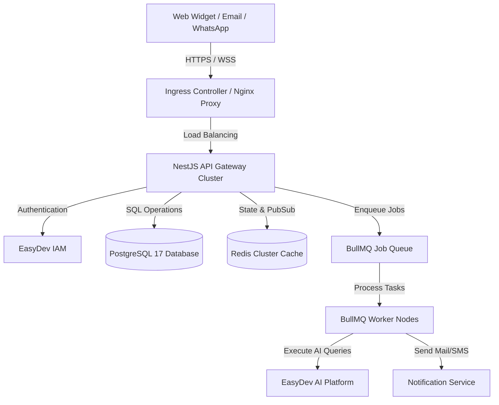

# EasyDev Support AI: Infrastructure, Sizing, and Scaling Guide

This document is the master playbook for the **Infrastructure and DevOps Teams**. It details service-specific resource profiles, scaling pathways (from a single Docker VM to a multi-node Kubernetes cluster), sizing metrics, and proactive troubleshooting procedures to avoid production downtime.

---

## 0. Actual Edge/TLS Topology (verified directly, 2026-06-24)

The rest of this document's "Ingress Controller / Nginx Proxy" framing (§1, §2.3) predates this verification and describes an alternative design, not what's actually wired. Recorded here so this doesn't need re-discovering:

- **A separate `infra/` repo** (sibling to this one, not under `Backend/`) runs the only real edge proxy: Traefik v2.11 + Portainer, terminating TLS via Let's Encrypt on an external Docker network named `edge` (`TRAEFIK_NETWORK_NAME=edge` in `infra/.env`).
- **A separate `easydev-infra` repo** (`docker network/easydev-infra` relative to this workspace - easy to miss, it's not alongside the other backend repos) defines the actual production compose stacks for 5 services, all already correctly joined to the `edge` network with real Traefik labels, TLS, and `expose`-only (no host port mapping) for Postgres/Redis: **gateway**, **auth-service** (`multi-tannet-auth-services`/IAM), **payment-service** (`payment-microservice`), **ai-automation-communication-service** (`multi-tennet-ai-agent`), and **job-agent-service**. Their own per-repo `docker-compose.production.yml`/`docker-compose.prod.yml` files explicitly say (in their own header comments) that they are NOT used for real deployment - `easydev-infra` is.
- **This repo, `notification-service`, and `file-upload-service` were not part of either stack at all** - the original launch-readiness audit's RR-03 finding ("no backend service is wired to Traefik, only multi-tennet-ai-agent") was accurate for these three specifically, but incorrect that IAM/payment-microservice/ai-agent were unwired - they already were, just via the easy-to-miss `easydev-infra` repo.
- **Fixed as part of RR-03's remediation**: this repo's `nginx` service (`docker-compose.production.yml`), `notification-service`'s own container, and `file-upload-service`'s own container all now join the external `edge` network and carry the same Traefik label convention as the other 5 services, with their direct host port mappings removed (Traefik becomes the sole public entrypoint). **Not yet folded into `easydev-infra`'s unified stack structure** - that would mean creating new stack folders/env-file conventions there, a real architecture decision involving secrets management this fix didn't make unilaterally. Each of these 3 services can be deployed today by running them alongside `infra/`'s Traefik stack on the same host/network; migrating them into `easydev-infra` properly is a follow-up, not done here.
- **Not yet verified against live infrastructure** - no Docker daemon available in the environment this fix was made in. The label syntax matches the proven-working pattern already used by `multi-tennet-ai-agent`'s entry in `easydev-infra`, character-for-character where applicable.

---

## 1. System Architecture Mapping



---

## 2. Service-by-Service Resource Profile & Allocations

Below is the detailed resource allocation matrix showing CPU, RAM, Disk, and Network requirements per service across all scaling tiers.

### Table 2.1: Sizing Specifications per Service

| Service | Tier 1: Baseline (100 Users / 100 Tenants) | Tier 2: Mid-Scale (1,000 Users / 200 Tenants) | Tier 3: High-Scale (10,000 Users / 1,000 Tenants) |
| :--- | :--- | :--- | :--- |
| **API Gateway** *(NestJS)* | **0.5 vCPU | 512 MB RAM**<br>• Replicas: 1 container | **1 vCPU | 1.5 GB RAM** per pod/container<br>• Replicas: 3 containers (shared VM) | **0.5 vCPU | 1 GB RAM** per pod/container<br>• Replicas: 3 to 20 containers (K8s HPA) |
| **Workers** *(BullMQ)* | **0.5 vCPU | 512 MB RAM**<br>• Replicas: 1 container | **2 vCPU | 3 GB RAM** per pod/container<br>• Replicas: 4 containers (shared VM) | **1 vCPU | 2 GB RAM** per pod/container<br>• Replicas: 2 to 50 containers (KEDA autoscaler) |
| **PostgreSQL 17** | **1 vCPU | 2 GB RAM** (e.g. `db.t4g.micro`) | **2 vCPU | 4 GB RAM** (e.g. `db.t4g.medium`) | **Primary:** 4 vCPU, 16 GB RAM (`db.m6g.xlarge`) <br>**Replica:** 2 vCPU, 8 GB RAM (`db.m6g.large`) |
| **Redis Cache** | **Shared Host CPU | 512 MB RAM** | **Dedicated VM: 1 vCPU | 3 GB RAM** | **Redis Master-Replica:** 2 Nodes (6.38 GB RAM each) |
| **Nginx / Ingress** | **Shared Host CPU | 128 MB RAM** | **Shared Host CPU | 256 MB RAM** | **Dedicated Node:** 2 vCPU, 4 GB RAM |
| **Observability** | **Shared Host CPU | 1 GB RAM** | **Dedicated VM: 2 vCPU | 4 GB RAM** | **Grafana Cloud / CloudWatch** (External Ingestion) |
| **Disk Storage** | 20 GB GP3 SSD (Shared Host) | 50 GB SSD (Database dedicated VM) | 100 GB SSD (Primary DB) + 100 GB SSD (Replica DB) |
| **Est. Monthly Cost** | **~$50 / month** | **~$180 / month** | **~$770 / month (VMs)** or **~$1,050 / month (K8s)** |

### 2.2 Single-VM Docker Host Configuration (All-in-One Setup)

If you are running **all services** (API, Workers, PostgreSQL database, Redis cache, Nginx proxy, and local telemetry services) inside Docker containers on a **single host VM** for initial development or staging, use the following sizing guidelines:

#### A. VM Instance Recommendation Table

| Resource Dimension | Minimum Setup (Low Usage / Testing) | Recommended Setup (Safe & Stable Production Dev) |
| :--- | :--- | :--- |
| **vCPUs** | **2 vCPUs** | **4 vCPUs** |
| **System Memory (RAM)**| **4 GB RAM** | **8 GB RAM** |
| **Disk Storage** | 20 GB SSD (GP3) | 50 GB SSD (GP3 / NVMe) |
| **AWS Instance Type** | `t3.medium` or `t4g.medium` (Graviton) | `t3.large` or `t4g.large` (Graviton) |
| **GCP Instance Type** | `e2-medium` | `e2-standard-2` or `c3-highcpu-4` |
| **DigitalOcean Droplet**| 2 vCPUs, 4GB RAM Droplet ($24/mo) | 4 vCPUs, 8GB RAM Droplet ($48/mo) |

#### B. Memory Allocation & Docker Resource Limits (For 8GB VM)

To prevent resource contention and sudden Out-Of-Memory (OOM) host crashes, define limits in your `docker-compose.yml`:

```yaml
services:
  api:
    environment:
      - NODE_OPTIONS="--max-old-space-size=1536"
    deploy:
      resources:
        limits:
          cpus: '1.0'
          memory: 1500M

  worker:
    environment:
      - NODE_OPTIONS="--max-old-space-size=2048"
    deploy:
      resources:
        limits:
          cpus: '1.5'
          memory: 2000M

  postgres:
    deploy:
      resources:
        limits:
          cpus: '1.0'
          memory: 2000M

  redis:
    deploy:
      resources:
        limits:
          cpus: '0.25'
          memory: 512M
```

#### C. Operational Safeguards
1. **Enable Swap Memory (Linux VM):** Allocate **4GB of Swap space** to act as a buffer in case memory usage spikes, preventing Linux from killing critical database processes.
2. **SSD Storage:** Always choose SSD storage (GP3 or NVMe) with at least 3000 IOPS to prevent Disk write blocking during concurrent PostgreSQL logs and Redis database updates.

### 2.3 API Gateway & Endpoint Isolation (Hiding Microservices)

To ensure internal services (Auth, Payment, Notification, Uploads, Support AI) are not exposed to the public internet, **Nginx** is configured as the single API Gateway. Only the Nginx ports (`80` / `443`) are bound to the host VM's public network interface. All other services communicate solely over the isolated Docker bridge network.

```
Public Request (HTTPS) ──> VM Interface (Port 443) ──> [ Nginx Gateway ]
                                                             │
                              ┌──────────────┬───────────────┼──────────────┬──────────────┐
                              ▼              ▼               ▼              ▼              ▼
                          [ Auth ]      [ Payment ]   [ Notification ]  [ Uploads ]   [ Support AI ]
                          (Port 3001)   (Port 3003)    (Port 3004)      (Port 3005)   (Port 3000)
```

#### A. Nginx Gateway Configuration (`/etc/nginx/conf.d/gateway.conf`)

Deploy Nginx on the host VM using the following routing configuration:

```nginx
# --- Internal Service Upstreams (Docker DNS resolution) ---
upstream auth_service {
    server auth:3001 max_fails=3 fail_timeout=10s;
    keepalive 16;
}

upstream payment_service {
    server payment:3003 max_fails=3 fail_timeout=10s;
    keepalive 16;
}

upstream notification_service {
    server notification:3004 max_fails=3 fail_timeout=10s;
    keepalive 16;
}

upstream upload_service {
    server upload:3005 max_fails=3 fail_timeout=10s;
    keepalive 16;
}

upstream ai_platform_service {
    server ai-platform:3002 max_fails=3 fail_timeout=10s;
    keepalive 16;
}

upstream support_ai_api {
    server api:3000 max_fails=3 fail_timeout=10s;
    keepalive 32;
}

# --- Gateway Virtual Host ---
server {
    listen 443 ssl http2;
    server_name api.easydev.in;

    ssl_certificate /etc/nginx/certs/live.crt;
    ssl_certificate_key /etc/nginx/certs/live.key;

    # Universal security parameters (Hiding internal application stack)
    proxy_hide_header X-Powered-By;
    proxy_hide_header X-AspNet-Version;
    proxy_hide_header Server;
    add_header Server "EasyDevGateway" always;
    add_header X-Frame-Options "DENY" always;
    add_header X-Content-Type-Options "nosniff" always;

    # 1. Authentication Service Routing
    location /v1/auth/ {
        limit_req zone=auth_limit burst=10 nodelay;
        proxy_pass http://auth_service;
        include conf.d/proxy_params.conf;
    }

    # 2. Payment Gateway Routing
    location /v1/payments/ {
        proxy_pass http://payment_service;
        include conf.d/proxy_params.conf;
    }

    # 3. Notifications Dispatcher Routing
    location /v1/notifications/ {
        proxy_pass http://notification_service;
        include conf.d/proxy_params.conf;
    }

    # 4. File Management & Uploads Routing
    location /v1/uploads/ {
        client_max_body_size 50m; # High payload allowed only for file service
        proxy_pass http://upload_service;
        include conf.d/proxy_params.conf;
    }

    # 5. AI Platform Integration Routing
    location /v1/ai-platform/ {
        proxy_pass http://ai_platform_service/;
        include conf.d/proxy_params.conf;
    }

    # 6. Support AI Gateway API Routing
    location /v1/support-ai/ {
        proxy_pass http://support_ai_api/;
        include conf.d/proxy_params.conf;
    }

    # 7. WebSocket Session Upgrades
    location /socket.io/ {
        proxy_pass http://support_ai_api;
        proxy_http_version 1.1;
        proxy_set_header Upgrade $http_upgrade;
        proxy_set_header Connection "upgrade";
        proxy_set_header Host $host;
        proxy_buffering off;
    }
}
```

#### B. Nginx Shared Proxy Headers (`conf.d/proxy_params.conf`)
Save these headers separately to apply consistently across all locations. This preserves tracing identifiers and hides backend details:
```nginx
proxy_http_version 1.1;
proxy_set_header Connection "";
proxy_set_header Host $host;
proxy_set_header X-Real-IP $remote_addr;
proxy_set_header X-Forwarded-For $proxy_add_x_forwarded_for;
proxy_set_header X-Forwarded-Proto $scheme;
proxy_set_header X-Request-ID $request_id;
proxy_set_header traceparent $http_traceparent;
```

#### C. Environment Variables Config (`.env`) for Gateway Routing

To ensure that the Support AI service and other internal clients route all their API integration traffic (Auth, Payments, Notifications, Files, AI Platform) through the Nginx Gateway rather than contacting internal microservices directly, configure your `.env` files as follows:

##### Option 1: Local Development Docker Setup (Nginx exposed on Host Port 8080)
If Nginx is mapped to port `8080` on the developer's localhost interface:
```properties
# Authentication & Session Management
IAM_SERVICE_URL=http://localhost:8080/v1/auth
IAM_SERVICE_INTERNAL_URL=http://localhost:8080/v1/auth

# AI Platform Integration
AI_PLATFORM_URL=http://localhost:8080/v1/ai-platform
AI_PLATFORM_INTERNAL_URL=http://localhost:8080/v1/ai-platform

# Notification Service Integration
NOTIFICATION_SERVICE_URL=http://localhost:8080/v1/notifications

# Payment Service Integration
PAYMENT_SERVICE_URL=http://localhost:8080/v1/payments

# File Upload Service Integration
FILE_UPLOAD_SERVICE_URL=http://localhost:8080/v1/uploads
FILE_UPLOAD_SERVICE_HEALTH_URL=http://localhost:8080/v1/uploads/health
```

##### Option 2: Production/Staging VM Cluster Setup (Nginx runs in Docker under internal name `nginx`)
Inside the private Docker network, Nginx is resolved using the service hostname `nginx` on port `80`. The public gateway endpoints are mapped to the registered DNS (e.g. `api.easydev.in`):
```properties
# Authentication & Session Management
IAM_SERVICE_URL=https://api.easydev.in/v1/auth
IAM_SERVICE_INTERNAL_URL=http://nginx/v1/auth

# AI Platform Integration
AI_PLATFORM_URL=https://api.easydev.in/v1/ai-platform
AI_PLATFORM_INTERNAL_URL=http://nginx/v1/ai-platform

# Notification Service Integration
NOTIFICATION_SERVICE_URL=http://nginx/v1/notifications

# Payment Service Integration
PAYMENT_SERVICE_URL=http://nginx/v1/payments

# File Upload Service Integration
FILE_UPLOAD_SERVICE_URL=http://nginx/v1/uploads
FILE_UPLOAD_SERVICE_HEALTH_URL=http://nginx/v1/uploads/health
```

#### D. Network Isolation Best Practices
1. **Docker Networks:** Place all service containers on a single internal docker network (e.g. `backend-network`) but do **not** publish their ports (e.g. do not use `- p 3001:3001`). Only expose Nginx ports `80` and `443` in the `docker-compose.yml` file.
2. **Host Firewalls (UFW / iptables):** Block any external traffic requesting direct access to the backend ports. Only allow public incoming packets on ports `80` and `443`.
   ```bash
   sudo ufw default deny incoming
   sudo ufw allow 80/tcp
   sudo ufw allow 443/tcp
   sudo ufw enable
   ```

### 2.4 SaaS Integration: Mounting onto an External Web Agency API Gateway

If your Web Agency wants to sell/distribute this Support AI service as a modular SaaS product under your own central agency domain, you can easily mount it onto your existing **Agency API Gateway** (e.g. Kong, Apache APISIX, Express Gateway, Nginx, or AWS API Gateway).

#### A. Gateway Routing and Path Mapping
Map a specific context path on your primary agency API domain to route to the Support AI service container:
* **Public Gateway Path:** `https://api.webagency.com/v1/support-ai/`
* **Internal Target:** `http://support-ai-api:3000/` (Note the trailing slash to strip the prefix)
* **WebSocket Path:** `https://api.webagency.com/socket.io/` must route to `http://support-ai-api:3000/socket.io/` with connection upgrade headers enabled to support real-time chat.

#### B. Dynamic Tenant Injection (White-Labeling Clients)
Since this application uses header-based multi-tenancy (`x-tenant-id`), you can make onboarding completely transparent for your agency clients:
1. When a client accesses their white-labeled portal (e.g., `https://client1.agency.com`), your central gateway intercepts the request.
2. The gateway performs a lookup (e.g., in your agency database) to map `client1.agency.com` to their Support AI `tenant_id` UUID.
3. The gateway injects the `x-tenant-id: <uuid>` header into the request *before* proxying it to the Support AI API.
4. **Result:** The client never sees or manages UUID headers, and your SaaS offering looks completely custom-built for them.

#### C. Cross-Origin Resource Sharing (CORS) for Widgets
Since you are selling chat widgets that clients will embed in their own websites (e.g. `https://clientwebsite.com`), your agency gateway must allow CORS. Ensure these headers are sent:
```nginx
Access-Control-Allow-Origin: $http_origin; # Reflects the client site dynamically
Access-Control-Allow-Credentials: true;
Access-Control-Allow-Headers: Content-Type, Authorization, x-tenant-id;
Access-Control-Allow-Methods: GET, POST, PUT, DELETE, OPTIONS;
```

---

## 3. The Scaling Pathway: When and How to Switch Setup

Moving between environments should be driven by resource data and user load triggers.

```
[ Tier 1: Single Docker VM ] ──(Trigger: VM CPU >80%, Users >1000)──> [ Tier 2: Clustered Docker VMs ] ──(Trigger: Deployments >2h/wk, Users >3000)──> [ Tier 3: Kubernetes (GKE/EKS) ]
```

### Table 3.1: Transition Triggers

| Current Setup | Target Setup | Sizing Triggers | Resource / Operational Triggers |
| :--- | :--- | :--- | :--- |
| **Tier 1: Single Docker VM** | **Tier 2: Clustered Docker VMs** | • Active users > 1,000<br>• Active tenants > 200 | • Single VM CPU usage consistently exceeding **80%**.<br>• Redis memory limits reached.<br>• Noisy neighbor database locking occurs. |
| **Tier 2: Clustered Docker VMs** | **Tier 3: Kubernetes (K8s)** | • Active users > 3,000<br>• Active tenants > 400 | • Deployment rollouts take more than **2 hours/week**.<br>• High-priority queue jobs lag behind processing spikes.<br>• Strict compliance requires dedicated tenant namespaces. |

### A. Step-by-Step Transition Actions

#### 1. Transitioning from Tier 1 (Single VM) to Tier 2 (Clustered VMs)
* **Separation of Concerns:** Move PostgreSQL and Redis out of the shared Application VM onto cloud-managed database/cache instances (e.g., AWS RDS, ElastiCache).
* **Nginx Load Balancer Deployment:** Set up a dedicated VM running Nginx to proxy-pass connections to multiple App VMs.
* **Scale Containers Locally:** Run `docker compose up -d --scale api=3 --scale worker=6` to split workloads within the VMs.

#### 2. Transitioning from Tier 2 (Clustered VMs) to Tier 3 (Kubernetes Cluster)
* **Container Registries:** Push Docker images to private registries (e.g. AWS ECR / GCR).
* **Deployment YAMLs:** Write Kubernetes resource deployment specifications (defined in [api-deployment.yaml](file:///C:/Users/kisho/WorkSpace/Backend/easydev-support-ai/k8s/api-deployment.yaml) and [worker-deployment.yaml](file:///C:/Users/kisho/WorkSpace/Backend/easydev-support-ai/k8s/worker-deployment.yaml)).
* **Autoscaling Configuration:** Set up Cluster Autoscaler, HPA, and **KEDA** (monitoring Redis keys).

---

## 4. Run-Book: Proactive Troubleshooting & Disaster Prevention

To prevent production issues, monitor these metrics and apply these solutions:

### Table 4.1: Common Infrastructure Bottlenecks & Troubleshooting Actions

| Symptoms / Trouble | Resource Bottleneck | Core Root Cause | Corrective Action / Solution |
| :--- | :--- | :--- | :--- |
| **API requests time out; client websocket disconnects.** | **Network TCP Port Exhaustion** | Nginx or OS host runs out of socket descriptors under high user load. | 1. Increase OS limits: `sysctl -w net.core.somaxconn=1024`<br>2. Add `keepalive_requests 10000;` to Nginx configs.<br>3. Enable sticky session cookies on Ingress. |
| **Database returns `too many connections` errors.** | **PostgreSQL Connection Exhaustion** | App nodes scaling without pooling; each node opens 2x pools of 20 connections. | 1. Enable **PgBouncer** sidecar in **Transaction Mode** on port `6432`.<br>2. Ensure `@easydev/database` does not use statement pre-preparation. |
| **BullMQ background jobs fail or lag; server CPU maxes out.**| **CPU / Worker Thread Lock** | CPU-intensive workflow scans run inside the primary node process loop. | 1. Separate queue workers into dedicated containers (`worker-conversation`, `worker-workflow`).<br>2. Restrict container CPUs to `limits: cpus: '2.0'`. |
| **App container crashes suddenly without stack traces.** | **OOM (Out Of Memory) Eviction** | Node.js process exceeds heap memory limit (default 1.4GB on VMs). | 1. Set environment variable: `NODE_OPTIONS="--max-old-space-size=2048"`.<br>2. Align Docker container memory limit constraints (`memory: 3000M`). |
| **Redis memory fills up, causing BullMQ jobs to reject.** | **Redis Out of Memory** | Caches storing session data without eviction policy. | 1. Set Redis config: `maxmemory-policy noeviction`.<br>2. Evict older key metrics; ensure Redis backup logs are persistently written to disk. |
| **Database query times degrade (latency > 100ms).** | **Disk IOPS / Table Lock** | Unindexed `tenant_id` queries scanning whole tables during high concurrent traffic. | 1. Apply schema migration to index high-traffic columns (`tenant_id`, `created_at`).<br>2. Offload heavy read operations to `readDb` pool on read replicas. |

---

## 5. Operations & Script Reference

The infrastructure team can quickly deploy or repair environments using the reference commands below:

### A. Failover Database Primary (Active-Replica Switchover)
If the primary PostgreSQL server suffers a hardware fault:
```bash
/bin/bash /scripts/dr-failover.sh
```

### B. Daily Database Backups Restore
To restore database state from encrypted daily snapshots:
```bash
/bin/bash /scripts/restore-postgres.sh "/backups/postgres/db_daily_latest.sql.gz.enc"
```

### C. Fast Deployment Rollback
If a new release causes high error ratios in metrics, rollback immediately:
```bash
/bin/bash /scripts/rollback-deployment.sh "production" "latest"
```
