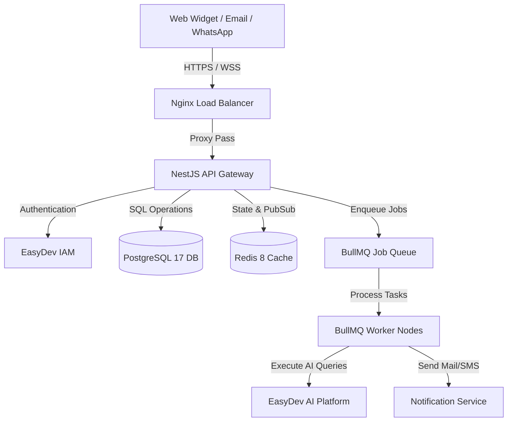

# EASYDEV SUPPORT AI: COMPLETE PRODUCT MANUAL & SYSTEM DOCUMENTATION

---

## CHAPTER 1: GETTING STARTED & SYSTEM OVERVIEW

### 1. Introduction
EasyDev Support AI is a multi-tenant, enterprise-grade customer support platform designed to orchestrate customer service operations by combining NestJS services, PostgreSQL, Redis caches, BullMQ task runners, Nginx edge routers, and advanced AI agents. 

### 2. Glossary of Terms
* **Tenant**: An isolated business entity with dedicated schema isolation, preferences, and data.
* **Workspace**: The web interface where agents view and manage tickets and conversations.
* **Connector**: An integration bridge mapping OpenAPI/Swagger configurations to external platforms.
* **Workflow**: A rule-based event trigger mapping conditions to target actions.
* **AI Support Agent**: A specialized LLM worker that parses user prompts and operates tools.

### 3. System Architecture Overview


---

## CHAPTER 2: TENANT ADMINISTRATION

### 1. Purpose & Overview
Manages the lifecycle of tenant accounts, resource quotas, HSTS domain white-labeling, brand assets, and tenant-level encryption boundaries.

### 2. Business Flow
1. Creation request initiated by administrator.
2. PostgreSQL allocates isolated DB partitions, generates a tenant uuid, and registers a unique encryption key.
3. Subdomain routes dynamically mapped in Nginx.

### 3. Step-by-Step Instructions
1. Navigate to `/admin/tenants`.
2. Click **Create Tenant**, enter Name and Domain.
3. Configure **Business Hours**: Click **Settings** -> **Business Hours** -> Add Monday-Friday timezone slots.
4. Upload custom brand assets under **Settings** -> **Branding** (Logos, primary HSL hex values).
5. Input custom DNS records for White Labeling (CNAME to `tenant.easydev.in`).

### 4. Screens involved
- Tenant Directory (`/admin/tenants`)
- Tenant Settings Panel (`/admin/tenants/:id/settings`)
- Brand Asset Customizer (`/admin/tenants/:id/branding`)

### 5. Permissions Required
- `sysadmin:write` (System Creator)
- `tenant:admin` (Tenant Owner)

### 6. Troubleshooting
* **DNS Validation Failing**: Ensure CNAME records are fully propagated (TTL 300) before triggering custom domain binding checks.
* **Asset Upload Failure**: Images must match size restrictions (< 2MB) and spoof checks (PNG/JPG MIME).

---

## CHAPTER 3: TEAM & CHANNEL MANAGEMENT

### 1. Purpose & Overview
Administrates human agent allocation, skill tags, assignment routing thresholds, and connects communication conduits (Email, Widget, WhatsApp, Telegram, Slack).

### 2. Business Flow
```
Channel Ingest (Email/Widget) ──> Webhook Gateway ──> Route Dispatcher ──> Agent Assignment Match (Capacity & Skill)
```

### 3. Step-by-Step Instructions
1. **Create Team**: Navigate to **Teams** -> **Add Team**. Assign Skills (e.g. `billing`, `tier-1`).
2. **Assign Agents**: Edit team rosters, specify agent capacities (e.g. max 5 concurrent chats).
3. **Connect Slack/Telegram Channel**:
   - Go to **Channels** -> **Connect Channel** -> Select **Slack**.
   - Input Client ID and Signing Key. Approve OAuth authorization.
4. **Setup Email Channel**: Enter SMTP relay host, IMAP polling frequency, and inbound mapping keys.

### 4. Permissions Required
- `team:write`
- `channel:write`

### 5. Troubleshooting
* **Slack Events Blocked**: Verify Slack App URL matches the webhook route `/v1/channels/slack/webhook`.
* **WhatsApp Media Fails**: Confirm media size falls within Meta API bounds (< 5MB for images).

---

## CHAPTER 4: CONVERSATIONS & UNIFIED INBOX

### 1. Purpose & Overview
Orchestrates live chat flows, inbox state updates, filters, agent actions, internal notes, tags, and conversation merging.

### 2. Business Flow
- Conversation Initiated -> State set to `OPEN` -> Sent to Unified Inbox -> Agent Claims/Assigned -> Resolved.

### 3. Step-by-Step Instructions
1. Open **Unified Inbox** (`/inbox`).
2. Apply filter: Status `OPEN`, SKILL `billing`. Click **Save View**.
3. **Merge Conversations**: Select two conversations, click **Bulk Actions** -> **Merge**. Choose primary ticket.
4. **Internal Note**: Toggle message box to **Internal Note**, tag colleague using `@username`.

### 4. Permissions Required
- `conversation:read`
- `conversation:write`

### 5. Troubleshooting
* **Realtime Updates Lag**: If WebSockets disconnect, the client falls back to HTTP polling. Refresh browser to trigger Socket.IO handshake on `ws.easydev.in`.

---

## CHAPTER 5: AI SUPPORT AGENT & KNOWLEDGE BASE

### 1. Purpose & Overview
Integrates RAG (Retrieval-Augmented Generation) based AI support to resolve tenant queries using document sources (PDFs, Web scraper, FAQs) with auto-handoff controls.

### 2. Business Flow
```
Customer Message ──> AI Agent Check ──> Query KB Vector DB ──> Generate Response (Confidence > 0.85) ──> Deliver
                                                      └──> (Confidence < 0.85) ──> Route to Human Queue
```

### 3. Step-by-Step Instructions
1. Navigate to **Knowledge Base** -> **Add Source**. Select **Scrape Website** or **Upload PDF**.
2. Select target file and click **Process & Embed**. Vector embedding queues in BullMQ.
3. Configure **AI Agent Settings**: Enable **Auto-Response**. Set Confidence threshold to `0.85`.
4. To override AI, click **Take Over** in the Inbox conversation panel to pause the AI thread instantly.

### 4. Troubleshooting
* **AI Hallucinations**: Ensure sources contain clear facts. Update document version and re-chunk.
* **High Cost Spikes**: Implement token limits per tenant under **Security** -> **Rate Limits** -> **AI API Limit**.

---

## CHAPTER 6: CONNECTORS & WORKFLOW ORCHESTRATION

### 1. Purpose & Overview
Integrates third-party platforms via Swagger/OpenAPI specifications, maps webhooks, and builds rule-based automated event pipelines.

### 2. Step-by-Step Instructions
1. **Install Connector**: Navigate to **Marketplace** -> Select **Salesforce** -> Enter API Credentials.
2. **Build Workflow**:
   - Go to **Workflows** -> **Create New**.
   - **Trigger**: Select `Ticket Created`.
   - **Condition**: Priority equals `HIGH`.
   - **Action**: Select Salesforce connector -> `Create Case`.
3. Save and click **Activate**.

### 3. Permissions Required
- `connector:write`
- `workflow:write`

---

## CHAPTER 7: ANALYTICS & WIDGET CONFIGURATION

### 1. Purpose & Overview
Visualizes system performance metrics, customer satisfaction, SLA breaches, and embeds customer-facing chat widgets.

### 2. Step-by-Step Instructions
1. **Widget Embed**: Navigate to **Widget Settings** -> Copy Javascript snippet. Paste it inside target webpage `<body>`.
2. Configure **Lead Capture Forms**: Enable fields for Email, Name, and Tenant domain routing.
3. Go to **Analytics** -> **Exports** to schedule daily CSV analytics events outputs sent to S3.

---

## CHAPTER 8: SECURITY, COMPLIANCE & AUDIT

### 1. Purpose & Overview
Assures tenant isolation, encrypts API keys, redacts PII data, manages permissions, and logs auditing actions.

### 2. Security Baselines
* **Data Redaction**: Webhook payloads are passed through PII scrapers (redacting Credit Cards, SSN, passwords).
* **Tenant Boundary Protection**: Custom PG row-level-security (RLS) guards schema queries using `x-tenant-id` boundaries.
* **Audit Trails**: Security actions are committed to `dr_audit_logs` and `audit_logs` SQL tables.

---

## CHAPTER 9: ADMINISTRATOR & OPERATION GUIDE

### 1. Disaster Recovery & Failovers
In the event of network splits or crashes:
* **Database Down**: Execute `/bin/bash /scripts/dr-failover.sh` to switch to the read-replica.
* **Rollbacks**: Revert deployment failures instantly:
  ```bash
  /bin/bash /scripts/rollback-deployment.sh "production" "latest"
  ```
* **Restore DB**:
  ```bash
  /bin/bash /scripts/restore-postgres.sh "/backups/postgres/db_daily_latest.sql.gz.enc"
  ```

---

## CHAPTER 10: API SPECIFICATIONS

### 1. Authentication
All endpoints require OAuth tokens or API keys passed via the `Authorization` header:
`Authorization: Bearer <token>`
And tenant headers:
`x-tenant-id: <uuid>`

### 2. Rest API Endpoint Examples

#### Get Widget Configuration
`GET https://api.easydev.in/v1/widget/config`
* **Response (200)**:
```json
{
  "widgetId": "wid-90021-3b",
  "widgetName": "EasyDev Customer Support",
  "themeColor": "#3b82f6",
  "welcomeMessage": "Hello! How can we assist you today?",
  "leadCaptureFields": ["name", "email"]
}
```

#### Start Widget Session
`POST https://api.easydev.in/v1/widget/session/start`
* **Request Payload**:
```json
{
  "anonymousId": "anon-uuid-889123",
  "userAgent": "Mozilla/5.0 Chrome/120.0",
  "deviceType": "desktop"
}
```
* **Response (201)**:
```json
{
  "sessionId": "sess-88912301",
  "token": "sess_jwt_token_payload_991823"
}
```

#### Submit Lead Information
`POST https://api.easydev.in/v1/widget/lead/capture`
* **Request Payload**:
```json
{
  "email": "lead-user@company.com",
  "name": "Alex Johnson",
  "company": "Enterprise Corp",
  "source": "widget-landing"
}
```
* **Response (201)**:
```json
{
  "leadId": "lead-991203",
  "status": "QUALIFIED"
}
```
