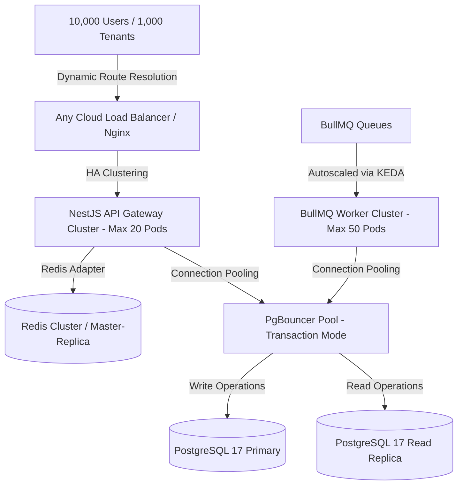

# EasyDev Support AI Scaling Guide: 100 to 10,000 Users / 100 to 1,000 Tenants

This document outlines the architectural blueprints, infrastructure configurations, and software optimizations required to scale **EasyDev Support AI** from its initial baseline to enterprise-scale deployment.

---

## 🚀 Scaling Overview & Objectives

| Metric | Current Baseline (Single Node) | Target Scale (High Availability) | Scaling Factor |
| :--- | :--- | :--- | :--- |
| **Active Concurrent Users** | ~100 | ~10,000 | **100x** |
| **Active Tenants** | 100 | 1,000 | **10x** |
| **Total Connections (Peak)** | <100 | ~3,000+ (pooled) | **30x** |
| **Queue Throughput** | ~50 jobs/sec | ~1,500 jobs/sec | **30x** |



---

## 1. Database Tier Scaling (PostgreSQL 17)

At 10,000 concurrent users and 1,000 tenants, database I/O, lock contention, and connection overhead will be the primary bottlenecks.

### A. Connection Pooling (PgBouncer)
As analyzed in our Docker Compose review, direct PostgreSQL connections will exhaust database memory at scale. We must introduce **PgBouncer** in **Transaction Mode**.
* **Reasoning:** In transaction pooling mode, PgBouncer reuses physical connections immediately after each transaction completes. This reduces the DB connection count from ~2,800 to a constant pool of 100-200.
* **Configuring pg driver:** Because PgBouncer in transaction mode does not support session-specific prepared statements, ensure the driver disables statement preparation if `PGBOUNCER_MODE` is enabled.
* **Implementation Plan:**
  Deploy PgBouncer as a sidecar or a dedicated service, modifying the database connection URLs to route through port `6432`.

### B. Multi-Tenant Partitioning & Isolation
Currently, tenants share the database schema under Row-Level Security (RLS). 
* **Partitioning Strategy:**
  1. Set up **Declarative Table Partitioning** by `tenant_id` for high-volume tables (e.g., `messages`, `audit_logs`).
  2. Implement a schema-per-tenant architecture if clients require strong regulatory compliance (e.g., HIPAA), using a database migration runner to deploy new schemas dynamically when tenant onboarding is triggered in [tenant-provisioning.service.ts](file:///C:/Users/kisho/WorkSpace/Backend/easydev-support-ai/src/modules/admin/services/tenant-provisioning.service.ts).

### C. Read/Write Split (Primary & Replicas)
Our database wrapper [db.ts](file:///C:/Users/kisho/WorkSpace/Backend/easydev-support-ai/packages/database/src/db.ts) already separates the primary write pool (`WriterPool`) from the replica read pool (`ReaderPool`):
* Configure `DATABASE_URL` to point to the primary PostgreSQL node (for writes).
* Configure `DATABASE_REPLICA_URL` to point to a distributed Read Replica pool.
* Update high-volume read endpoints (like analytics queries or ticket list views) to explicitly invoke the `readDb` instance rather than `db`.

---

## 2. Redis & Queue Scaling (BullMQ)

The Redis instance handles session storage, WebSocket pub-sub, and background job orchestration via BullMQ.

### A. Redis Cluster Migration
A single-node Redis instance (configured in [docker-compose.local.yml](file:///C:/Users/kisho/WorkSpace/Backend/easydev-support-ai/docker-compose.local.yml)) will experience memory exhaustion and network CPU saturation under 10,000 active WebSocket users.
* **Action:** Transition from Redis Standalone to **Redis Sentinel** (for failover) or **Redis Cluster** (sharded across 3 master nodes and 3 replica nodes).
* **Socket.IO Scaling:** Ensure Socket.IO uses the `@socket.io/redis-adapter` linked to the Redis Cluster to synchronize messages across API instances.

### B. BullMQ Job Optimization
Under 1,000 tenants, background jobs (analytics updates, LLM requests, webhook processing) will surge.
* **Priority Queues:** Divide workers into distinct processor groups like `worker-conversation` and `worker-workflow` to isolate resources.
* **Concurrency Configuration:** Tune worker concurrency levels dynamically. For instance, CPU-bound tasks (AI parsing) should keep concurrency low (~2-5), while I/O-bound tasks (email webhook dispatches) should scale concurrency up to 50+ per worker.
* **Backpressure Mitigation:** Use KEDA (Kubernetes Event-driven Autoscaling) to scale worker pods from 2 to 50 based on queue depth (defined in [worker-deployment.yaml](file:///C:/Users/kisho/WorkSpace/Backend/easydev-support-ai/k8s/worker-deployment.yaml)).

---

## 3. Application Tier Scaling (NestJS Gateway & Workers)

### A. Horizontal Autoscaling
* **API Gateway Pods:** 
  The API handles heavy HTTP and WebSocket traffic. 
  * Apply Horizontal Pod Autoscaler (HPA) targets mapping to CPU and Memory limits (defined in [api-deployment.yaml](file:///C:/Users/kisho/WorkSpace/Backend/easydev-support-ai/k8s/api-deployment.yaml)).
  * Scale replicas from **3** to **20** when CPU utilization exceeds 70%.
* **Worker Pods:**
  * Scale dynamically using KEDA based on the Redis key length of `bull:incoming-messages:wait`.

### B. Memory and Garbage Collection Tuning
At 10,000 users, Node.js memory leaks can lead to frequent crashloops.
* **Node Options:** Start NestJS processes with `--max-old-space-size=2048` (2GB allocation).
* **Resource Quotas:** Set Kubernetes limits strictly to prevent memory starvation of other pods:
  * API Gateway: `memory: 2Gi` (Limit), `cpu: 1000m` (Limit)
  * Worker: `memory: 4Gi` (Limit), `cpu: 2000m` (Limit)

---

## 4. Network & Load Balancing (Nginx / Ingress)

* **Nginx Configuration Tuning:**
  Currently, Nginx uses standard proxy mappings (defined in [nginx.conf](file:///C:/Users/kisho/WorkSpace/Backend/easydev-support-ai/nginx.conf)). Update configurations to support:
  * `keepalive_requests 10000;` to allow persistent connections and avoid TCP port exhaustion.
  * Increased socket descriptors limit: `worker_rlimit_nofile 65535;`.
* **Sticky Sessions:**
  WebSocket handshakes require client affinity to the same pod until established. Configure ingress annotations with sticky session cookies:
  ```yaml
  nginx.ingress.kubernetes.io/affinity: "cookie"
  nginx.ingress.kubernetes.io/session-cookie-name: "route"
  ```

---

## 5. Observability & Rate Limiting at Scale

### A. Log Sampling and Retention
At 10,000 concurrent users, Grafana Loki and Tempo trace storage will grow exponentially.
* **Log Sampling:** Configure OpenTelemetry tracing to sample only 5% of successful requests (`otel_sampler_ratio=0.05`), while retaining 100% of error/exception traces.
* **Loki Retention:** Set Loki's storage retention policy to 7 days, discarding debug logs within 24 hours.

### B. Tenant Quotas & API Rate Limits
To prevent a single tenant from starving resources of other tenants (noisy neighbor effect):
* Enforce **Global & Tenant-Specific Rate Limits** (configured using `@nestjs/throttler` or Nginx rate-limiting).
* Assign quotas to high-cost operations (such as AI vector uploads and LLM message dispatches).

---

## 6. Docker Compose to Kubernetes (K8s) Transition Matrix

To prevent unnecessary DevOps overhead, avoid migrating to Kubernetes prematurely. Use the three tables below to determine if your platform has reached the transition point.

### Table 6.1: Sizing, Resources, and Cost Thresholds

| Sizing Dimension | Docker Compose (Low Scale Baseline) | Kubernetes Cluster (High Scale Target) | Transition Trigger |
| :--- | :--- | :--- | :--- |
| **Concurrent Users** | < 1,000 active users | 1,000 to 10,000+ active users | Active users exceed 1,000 |
| **Active Tenants** | < 200 tenants | 200 to 1,000+ tenants | Onboarded tenants exceed 200 |
| **Host CPU Sizing** | 2 to 4 Cores (e.g. `t3.medium`) | 12+ Cores (e.g. 3x `c6g.xlarge` nodes) | Single-node CPU usage consistently > 80% |
| **Host RAM Sizing** | 4 to 8 GB RAM | 24+ GB RAM (across node pool) | Single-node RAM usage consistently > 85% |
| **App Redundancy** | Single Host (SPOF - Single Point of Failure) | Multi-AZ Node Groups (Auto-healing) | SLA requires > 99.9% availability |
| **Release Strategy** | Downtime during updates (15-60s) | Rolling updates (zero downtime) | Deployments must occur during business hours |
| **Estimated Cost** | ~$50 / month | ~$1,050 / month | Infrastructure budget matches scale expansion |

### Table 6.2: Core Architectural Bottlenecks & Operational Triggers

| Limit Type / Bottleneck | Behavior under Docker Compose | Solution under Kubernetes (K8s) | Business Impact / User Experience |
| :--- | :--- | :--- | :--- |
| **Noisy Neighbors** | One tenant running massive workflows or AI scans starves CPU/RAM for all other tenants. | Strict **CPU & Memory Requests/Limits** configured per tenant or pod type. | Guarantees resource isolation and stable response times for all tenants. |
| **Database Pool Overload**| Direct DB connections from multiple worker replicas exhaust Postgres connection limits. | **PgBouncer** sidecar running in Transaction Mode limits active database backend pools. | Prevents application-wide database connection dropouts and crashes. |
| **WebSocket Connections** | Single Node.js thread struggles to parse thousands of active socket.io handshakes. | Pod horizontal scaling with `@socket.io/redis-adapter` distributing events. | Seamless real-time unified inbox sync for agents. |
| **Queue Backlog Spikes** | BullMQ workers process jobs sequentially; long queues cause notification/webhook lag. | **KEDA (Kubernetes Event-driven Autoscaler)** scales workers from 2 to 50 pods instantly. | Eliminates latency spikes on critical background jobs under heavy load. |

### Table 6.3: Component-by-Component Migration Mapping

| Component | Docker Compose (Baseline) | Kubernetes (Target HA Setup) | Purpose / Technical Benefit |
| :--- | :--- | :--- | :--- |
| **NestJS API Gateway** | Single container in bridge network | 3x to 20x Pods (autoscaling via HPA) | Horizontal scaling handles HTTP/WS request spikes. |
| **BullMQ Worker** | Single container running all queues | Isolated Pod deployments per queue type | Prevents memory-intensive jobs from blocking lightweight webhooks. |
| **PostgreSQL DB** | Local container (non-HA) or single RDS | Multi-AZ RDS (Primary + Read Replica) | Eliminates data loss risks and offloads analytical queries. |
| **Redis Cache** | Single standalone container | Managed Redis Sentinel or Cluster (ElastiCache) | Ensures high-throughput queue processing and session persistence. |
| **Ingress Controller** | Nginx container mapping host ports | Managed Ingress (e.g. AWS ALB Controller) | Provides dynamic SSL termination, routing, and sticky sessions. |


