# Business Flows & Integration Blueprint

> **Audience.** Backend engineers integrating an external application
> (web app, CRM, ATS, helpdesk, e-commerce backend, RPA, etc.) with the
> Multi-Tenant AI Operating Platform.
> **Goal.** A single document that explains **what the platform actually
> does in business terms**, **how each domain workflow is executed
> end-to-end**, and **what an integrator must build** to consume it
> correctly — with diagrams, no source-code reading required.

This file complements:

- [api.md](api.md) — public HTTP contract
- [workflows.md](workflows.md) — workflow lifecycle, retries, discovery
- [integration-guide.md](integration-guide.md) — per-channel request/response examples
- [integration-architecture.md](integration-architecture.md) — connectivity, auth, deployment
- [tool-calls.md](tool-calls.md) — `WAITING_TOOL` / `WAITING_APPROVAL` resume mechanics

---

## 1. What this platform is (business view)

The platform is a **workflow execution engine** for AI tasks.
It is **not** a chatbot, prompt wrapper, or RAG library.

Your application owns the business records (users, candidates, orders,
tickets, contracts). The platform owns:

- **Generation** — drafting replies, summaries, outreach, contract clauses
- **Extraction** — structured fields out of free text or scanned docs
- **Classification** — intent, sentiment, priority, routing
- **Embedding & reranking** — semantic search and candidate ⇄ JD matching
- **Orchestration** — multi-step workflows with tool callbacks and human approvals
- **Routing & resilience** — picking the right LLM, retrying, falling over
- **Audit & observability** — event-sourced trail per `trace_id` / `tenant_id`

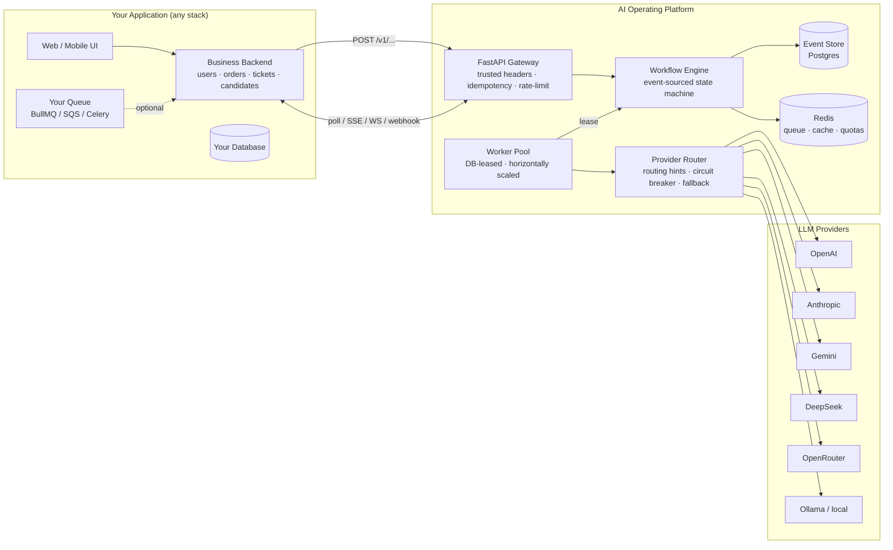

### Division of responsibility

| Owns | Your application | AI Platform |
|------|------------------|-------------|
| Users, tenants, billing | ✅ | ❌ |
| Domain records (orders, tickets, candidates, contracts) | ✅ | ❌ |
| Channel adapters (Gmail, WhatsApp, Slack, Zendesk, …) | ✅ (deliver/send) | ❌ |
| Authoritative business state | ✅ | ❌ |
| AI generation / classification / extraction / embedding | ❌ | ✅ |
| Provider selection, retries, fallback, circuit breaking | ❌ | ✅ |
| Workflow durability, event log, state transitions | ❌ | ✅ |
| Output schema validation | ❌ | ✅ |
| Tenant-scoped context, prompt registry, model defaults | ❌ | ✅ |

---

## 2. End-to-end request lifecycle

Every call from your app follows the same async pattern: **submit → poll
or stream → (optional tool / approval callback) → consume result**.

### 2.1 Required request headers

| Header | Required | Example | Purpose |
|--------|----------|---------|---------|
| `Content-Type` | yes (POST) | `application/json` | UTF-8 JSON only |
| `x-tenant-id` | forwarded by your gateway | `tenant_acme` | Tenant scope; trusted, not validated by this service |
| `x-principal-id` | forwarded by your gateway | `user_42` | Audited as the actor on every event; trusted, not validated by this service |
| `x-trace-id` | optional | `01HX2N5G6E0X4Z7V8YQK0V8RPT` | Server generates ULID if absent; echoed in `response.trace_id` and `x-trace-id` response header |
| `Idempotency-Key` | recommended on retried POSTs | `evt-2026-06-01-9981` | Deduplicates state-changing requests; conflict returns `409 idempotency_key_conflict` / `idempotency_key_in_progress` |

Authentication and authorization are performed upstream, by your API gateway.
This service trusts `x-tenant-id` / `x-principal-id` and does not validate
them further. See [authentication.md](authentication.md).

### 2.2 Canonical request body (`AICommandRequest`)

Used by `/v1/generate`, `/v1/classify`, `/v1/extract`, `/v1/embed`,
`/v1/rerank`, `/v1/summarize`, and `/v1/workflows/run`.

```json
{
  "tenant_id": "tenant_acme",
  "workflow": "support_automation",
  "task": "generate_customer_reply",
  "context_ids": ["brand_acme_v3", "persona_support"],
  "context": {
    "case": { "customer_id": "customer_789", "order_id": "8821" }
  },
  "payload": {
    "channel": "email",
    "message": "Where is my order?"
  },
  "provider": { "provider": "openai", "model": "gpt-4o-mini" },
  "token_budget": { "max_input_tokens": 8000, "max_output_tokens": 1024 },
  "timeout_seconds": 300,
  "max_attempts": 3
}
```

**Validation rules** (enforced by Pydantic, server-side):

| Field | Constraint |
|-------|------------|
| `tenant_id` | 1–128 chars, matches `^[A-Za-z0-9][A-Za-z0-9_.:-]{0,127}$`, must equal `x-tenant-id` header |
| `workflow` | 3–128 chars, lower_snake_case `^[a-z][a-z0-9_]*$`, must be registered in `GET /v1/workflows` |
| `task` | 1–128 chars; label for this invocation (free identifier) |
| `context_ids` | up to 50 (`MAX_CONTEXT_IDS`), unique, normalized |
| `payload` / `context` | recursively validated: ≤ 256 KiB serialized (`MAX_PAYLOAD_BYTES`), ≤ 16 levels deep (`MAX_PAYLOAD_DEPTH`) |
| `provider` | optional override; ignored if tenant policy forbids the provider |
| `token_budget.max_input_tokens` | default 100 000, cap 1 000 000 |
| `token_budget.max_output_tokens` | default 4 096, cap 200 000 |
| `timeout_seconds` | 1–604 800 (7 days) |
| `max_attempts` | 1–10 (default 3, env `AI_PLATFORM_WORKFLOW_MAX_ATTEMPTS`) |

Violations return `422 validation_error` with `details.field` pointing to
the offending path.

### 2.3 Canonical submit response (`QueuedWorkflowResponse`, HTTP 202)

```json
{
  "success": true,
  "trace_id": "01HX2N5G6E0X4Z7V8YQK0V8RPT",
  "job_id": "a9f3c1f7e8c44f4ba642cfb0c2d6764e",
  "workflow_id": "d65cb4dc8e624d209344a41c1f7922dd",
  "workflow": "support_automation",
  "status": "QUEUED"
}
```

**Persist `workflow_id`** against your domain record — it is the
integration's primary key for status, tool callbacks, approvals,
cancellation, replay, SSE, and WebSocket subscriptions.

### 2.4 Canonical status response (`WorkflowStatusResponse`, HTTP 200)

```json
{
  "success": true,
  "trace_id": "01HX2N5G6E0X4Z7V8YQK0V8RPT",
  "workflow_id": "d65cb4dc8e624d209344a41c1f7922dd",
  "job_id": "a9f3c1f7e8c44f4ba642cfb0c2d6764e",
  "workflow": "support_automation",
  "status": "WAITING_TOOL",
  "attempt_count": 1,
  "max_attempts": 3,
  "next_attempt_at": null,
  "timeout_at": "2026-06-01T12:30:00Z",
  "pending_action": {
    "type": "tool_request",
    "tool_name": "order_lookup",
    "tool_call_id": "tc_01HX...",
    "arguments": { "order_id": "8821" }
  },
  "result": null,
  "error": null
}
```

| Field | Type | Notes |
|-------|------|-------|
| `status` | `WorkflowState` enum | `QUEUED`, `RUNNING`, `WAITING_TOOL`, `WAITING_APPROVAL`, `SUCCESS`, `FAILED`, `CANCELLED`, `DEAD` |
| `attempt_count` | int ≥ 0 | Incremented each retry |
| `next_attempt_at` | RFC 3339 \| null | Set while in `RETRY_SCHEDULED` / `QUEUED` after a retry |
| `timeout_at` | RFC 3339 \| null | Hard deadline; engine emits `WORKFLOW_TIMEOUT` once passed |
| `pending_action` | object \| null | Populated only in `WAITING_TOOL` / `WAITING_APPROVAL`. See §§6–7 |
| `result` | object \| null | Populated on `SUCCESS`. Shape defined by the workflow's prompt YAML `output_schema` |
| `error` | object \| null | Populated on `FAILED` / `DEAD`. Shape: `{ code, message, attempts, last_provider }` |

### 2.5 Sequence

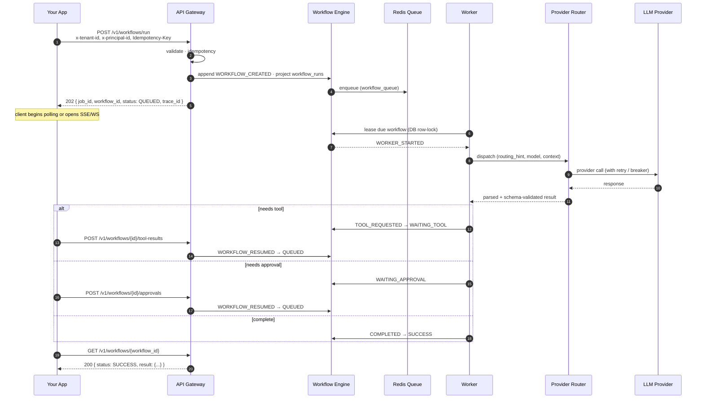

**Four integration patterns** for picking up results:

| Pattern | Endpoint | When to use |
|---------|----------|-------------|
| Poll | `GET /v1/workflows/{workflow_id}?tenant_id=...` | Default — works everywhere, no socket plumbing. Backoff: 1 s → 3 s → 5 s → cap 30 s. |
| Server-Sent Events | `GET /v1/realtime/workflows/{workflow_id}/events?tenant_id=...` | Live admin UI, browser-side progress bar. `Content-Type: text/event-stream`. |
| WebSocket | `WS /v1/realtime/workflows/{workflow_id}/ws?tenant_id=...` | Existing socket session. Closes with `WS_1008_POLICY_VIOLATION` if tenant mismatch. |
| Outbound webhook | platform-configured per tenant | Fire-and-forget producers without polling infra. Delivery + retry: [webhooks.md](webhooks.md). |

**Recommended poller** (Node example):

```ts
async function pollUntilTerminal(workflowId: string, tenantId: string) {
  const terminal = new Set(["SUCCESS", "FAILED", "CANCELLED", "DEAD"]);
  const delays = [1000, 1500, 2500, 4000, 6000, 10_000, 15_000, 30_000];
  for (let i = 0; ; i++) {
    const r = await fetch(
      `${BASE}/v1/workflows/${workflowId}?tenant_id=${tenantId}`,
      { headers: { "x-tenant-id": tenantId, "x-principal-id": principalId } },
    );
    if (r.status === 404) throw new Error("workflow_not_found");
    const body = await r.json();
    if (body.status === "WAITING_TOOL") return await resolveTool(body);
    if (body.status === "WAITING_APPROVAL") return await routeForApproval(body);
    if (terminal.has(body.status)) return body;
    await sleep(delays[Math.min(i, delays.length - 1)]);
  }
}
```

---

## 3. Workflow state machine

Every workflow is durable from the moment `POST` returns 202.

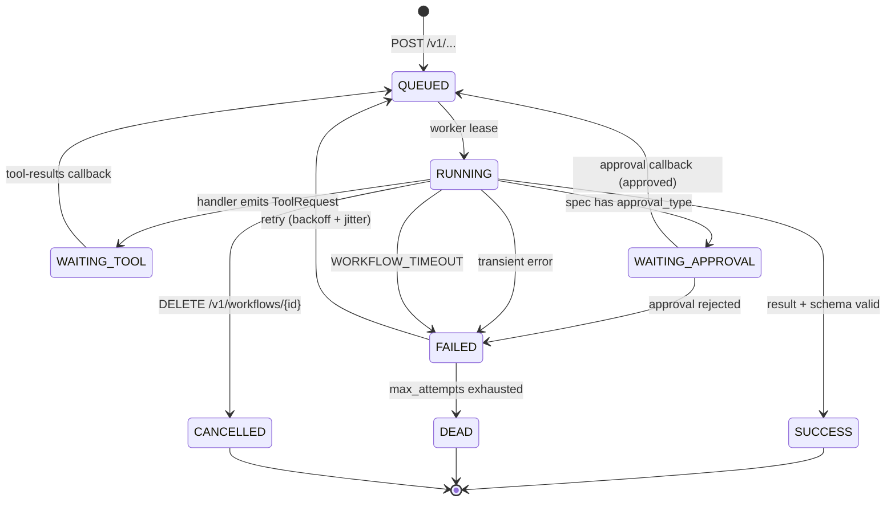

Terminal states: **`SUCCESS`**, **`CANCELLED`**, **`DEAD`**.
Full state semantics: [workflows.md §2](workflows.md#2-state-machine).

---

## 4. Provider routing logic

You never call OpenAI / Anthropic / Gemini yourself. The router picks
based on the workflow's `routing_hint`, the request override, env
overrides, and tenant policy — and falls over automatically.

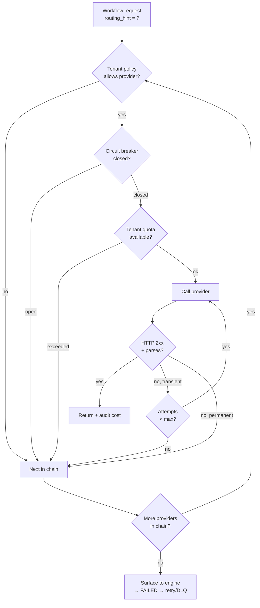

| Routing hint | Primary tier | Typical workflows |
|--------------|--------------|-------------------|
| `premium_communication` | Anthropic → OpenAI → Gemini | recruiter outreach, refunds, complaints, email reply |
| `structured_json` | OpenAI → DeepSeek → Anthropic | extraction, order status, invoice parsing, resume parsing |
| `long_context` | Gemini → Anthropic | contract review, document intelligence, long threads |
| `bulk_processing` | DeepSeek → OpenRouter | batch matching, classification, sentiment at scale |
| `fallback` | OpenRouter | catch-all when others exhausted |
| `auto` | platform default → OpenRouter | telegram/slack/discord, generic generation |

Full table and override precedence: [provider-routing.md](provider-routing.md).

---

## 5. Domain business flows

Each subsection: **business trigger → workflow → payload contract →
diagram → result shape → integrator checklist**.

The authoritative list of all 52 workflows is `GET /v1/workflows` —
**fetch this at integration startup** rather than hardcoding names.

### 5.1 Customer support automation

**Trigger.** Inbound email / chat / ticket. You need a draft reply
grounded in real order data, not invented details.

**Workflow.** `support_automation` (legacy pipeline) or
`customer_support_workflow` (CRM-tagged variant) or channel-specific
(`email_reply_workflow`, `whatsapp_workflow`, `slack_workflow`, …).

**Pipeline.** `classify → extract → tool_request (order lookup) → generate`.

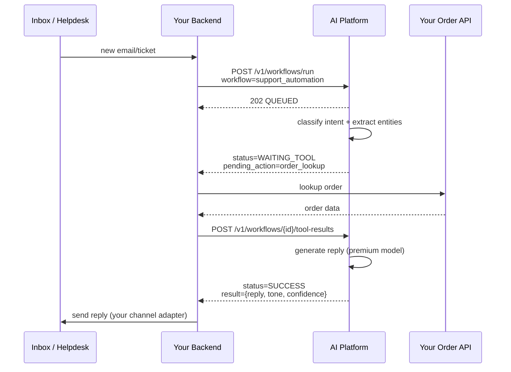

**Result shape.**

```json
{
  "intent": "order_status",
  "entities": { "order_id": "12345" },
  "reply": { "subject": "Re: Your order #12345", "body": "..." },
  "tone": "empathetic",
  "confidence": 0.92
}
```

**Integrator checklist.**

- [ ] Map your inbound channels to `support_automation` or the
      channel-specific workflow (`email_reply_workflow`, etc.).
- [ ] Implement the **tool callback** for any tool named in the
      workflow spec (`order_lookup`). See [tool-calls.md](tool-calls.md).
- [ ] Persist `workflow_id` against your ticket so retries and webhooks
      can be correlated.
- [ ] Never auto-send when `confidence < your threshold` — route to
      human review.

---

### 5.2 E-commerce: order status, refund, complaint

**Workflows.**
- `order_status_workflow` — tool: `order_lookup`
- `refund_workflow` — tools: `order_lookup`, `refund_initiate`; **approval-gated** (`refund_approval`)
- `complaint_resolution_workflow` — tools: `order_lookup`, `compensation_offer`

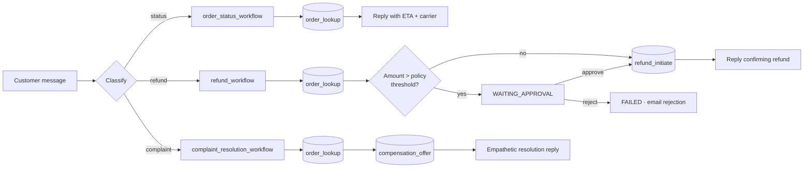

**Integrator checklist.**

- [ ] Implement `order_lookup`, `refund_initiate`, `compensation_offer`
      as **tool callbacks** (your domain logic).
- [ ] Wire `approver` role in your auth system for refunds above your
      policy threshold; expose an Approve/Reject UI to that role.
- [ ] Treat the AI `result.refund_amount` as a **proposal**, not an
      execution — your backend performs the actual payment refund.

---

### 5.3 Recruitment: matching, shortlisting, outreach

**Workflows.**

| Workflow | Pipeline | Approval | Notes |
|----------|----------|----------|-------|
| `job_matching_workflow` | `extract → embed → rerank → score` | no | bulk, runs against many candidates |
| `resume_selection_workflow` | `extract → score → shortlist` | no | returns ranked top-N |
| `recruiter_reply_workflow` | `extract → generate` | **yes** | recruiter sees draft before send |
| `interview_followup_workflow` | `generate` | no | thank-you / next-steps |
| `resume_parsing_workflow` | `ocr → extract` | no | PDF/DOC → structured profile |

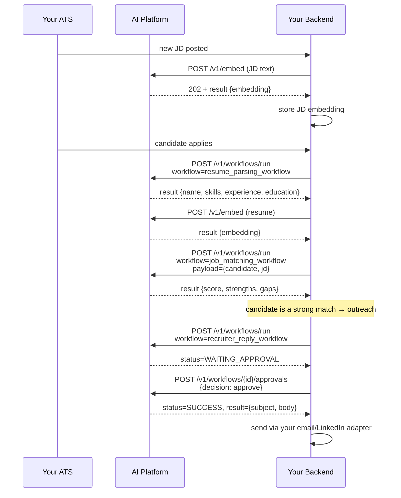

**Integrator checklist.**

- [ ] Store embeddings in **your** vector DB (pgvector / Pinecone /
      Qdrant). The platform returns vectors; persistence is yours.
- [ ] Always run `resume_parsing_workflow` once per upload; cache the
      structured profile — don't re-parse on every match.
- [ ] Recruiter outreach is approval-gated by design. Build the
      approver UI before going live.

---

### 5.4 Calendar & scheduling

**Workflows.**
- `meeting_scheduling_workflow` — extract intent, propose slots
- `calendar_workflow` — generic calendar reasoning
- `reminder_workflow` — outbound reminder composition

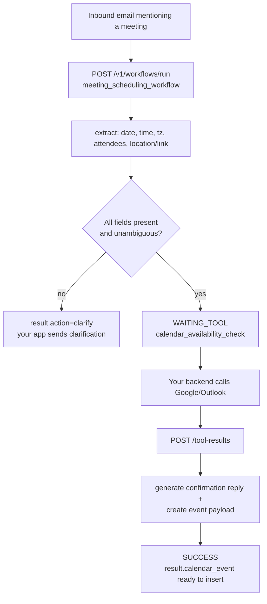

**Result shape.**

```json
{
  "extracted": { "date": "2026-06-04", "time": "14:00", "timezone": "Asia/Kolkata", "duration_minutes": 30, "meeting_link": null },
  "calendar_event": { "title": "...", "start": "...", "end": "...", "attendees": [...] },
  "reply": { "subject": "...", "body": "..." }
}
```

**Integrator checklist.**

- [ ] Implement `calendar_availability_check` as a tool callback that
      queries the real calendar.
- [ ] After `SUCCESS`, **your backend** inserts the event into Google
      Calendar / Outlook and sends the reply; the platform never does.

---

### 5.5 Document intelligence

**Workflows.**
- `document_workflow` — general purpose
- `ocr_workflow` — OCR only, returns clean text + layout hints
- `invoice_processing_workflow` — vendor / line items / totals / tax
- `contract_review_workflow` — clauses, obligations, risk flags; **approval-gated**
- `resume_parsing_workflow` — see §5.3

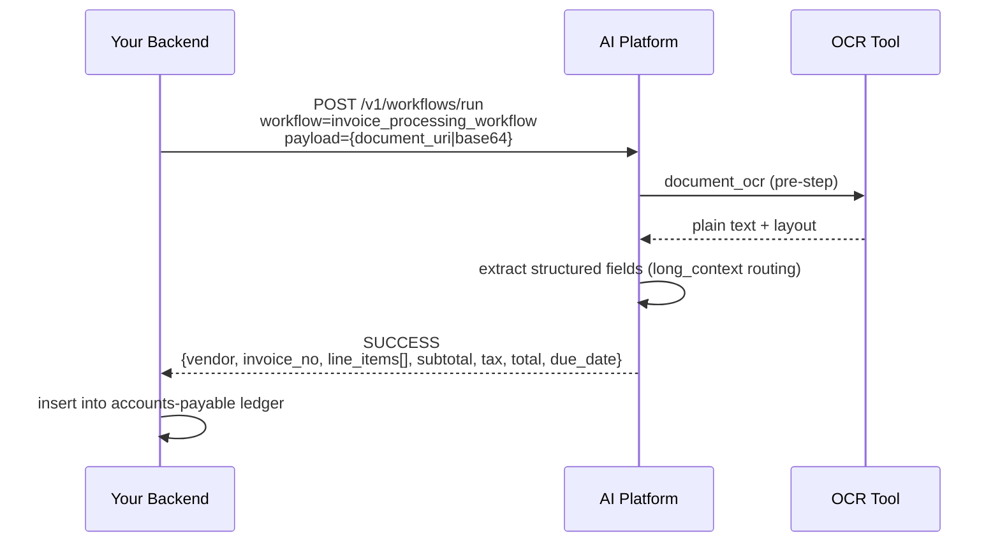

**Integrator checklist.**

- [ ] For PDFs: upload to your object store and pass a signed URL, **or**
      send base64 in payload if under 256 KiB (`MAX_PAYLOAD_BYTES`).
- [ ] Contract review returns `risk_score` and `clauses[]`. Set a
      `risk_score` threshold above which the workflow's
      `contract_review_approval` gate must be cleared before any
      downstream signing automation runs.

---

### 5.6 CRM workflows

**Workflows.**
- `lead_qualification_workflow` — BANT / MEDDIC scoring from notes
- `lead_scoring_workflow` — numeric score + reasoning
- `crm_followup_workflow` — drafts next outreach based on history
- `customer_support_workflow` — see §5.1
- `crm_workflow` (legacy) — generic CRM pipeline

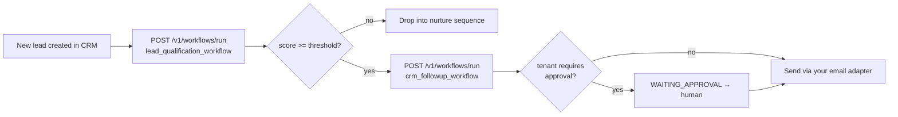

---

### 5.7 Analytics

**Workflows.**
- `sentiment_analysis_workflow` — per-message or batched
- `anomaly_detection_workflow` — outlier detection on event streams
- `reporting_workflow` — narrative summary over your aggregated metrics

These are typically **batched / scheduled** rather than user-triggered.
Submit through a producer (cron, your queue) and consume via webhook.

---

### 5.8 Multi-channel communication

All channel workflows share the same shape: take a message + context,
produce a channel-appropriate draft. Tool callbacks (`telegram_send`,
`whatsapp_send`, `slack_send`, `discord_send`, `sms_send`) are
**optional** — when present, your backend performs the actual delivery.

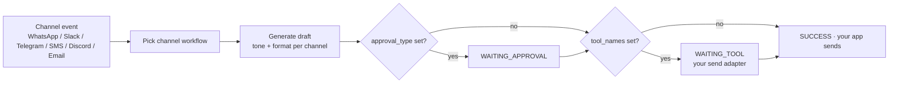

| Channel | Workflow | Tool | Approval |
|---------|----------|------|----------|
| Email (compose) | `email_workflow` | — | `email_send_approval` |
| Email (reply) | `email_reply_workflow` | — | `email_send_approval` |
| Telegram | `telegram_workflow` | `telegram_send` | — |
| WhatsApp | `whatsapp_workflow` | `whatsapp_send` | — |
| Slack | `slack_workflow` | `slack_send` | — |
| Discord | `discord_workflow` | `discord_send` | — |
| SMS | `sms_workflow` | `sms_send` | — |
| Auto follow-up | `auto_followup_workflow` | scheduling tool | — |

---

### 5.9 Custom & agent workflows

When the built-in 52 don't fit:

- **`custom_workflow`** — pass `workflow_definition` in payload
  (system prompt, rules, output schema). No deployment required.
  Best for tenant-specific experiments.
- **`agent_workflow`** — multi-step agentic loop with tool use.
- **`composite_workflow`** — chain multiple workflows server-side.

For durable, productised flows, ship a real plugin instead — see
[custom-workflow-cookbook.md](custom-workflow-cookbook.md).

---

## 6. Tool callback flow (deep dive)

When a workflow spec lists `tool_names`, the worker may emit
`TOOL_REQUESTED` and pause in `WAITING_TOOL`. The platform never calls
your business APIs directly — **you** resolve the tool and post the
result back.

### 6.1 Sequence

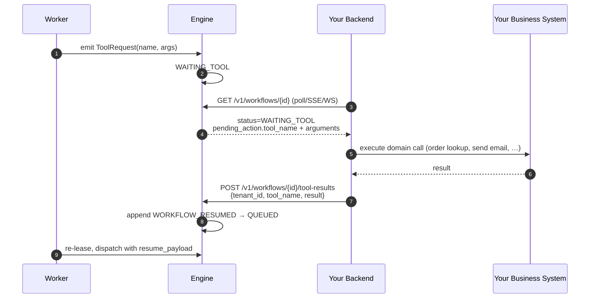

### 6.2 Exact request contract

**Endpoint.** `POST /v1/workflows/{workflow_id}/tool-results`
**Permission.** `run_workflow` (roles: `admin`, `operator`, `workflow_operator`).
**Status codes.** `200 OK` on success, `404 workflow_not_found`,
`409 workflow_state_conflict` if the workflow is not in `WAITING_TOOL`
**or** the `tool_name` doesn't match `pending_action.tool_name`.

```http
POST /v1/workflows/d65cb4dc8e624d209344a41c1f7922dd/tool-results
x-tenant-id: tenant_acme
x-principal-id: support-bot
Idempotency-Key: order-lookup-8821-attempt-1
Content-Type: application/json

{
  "tenant_id": "tenant_acme",
  "tool_name": "order_lookup",
  "result": {
    "order_id": "8821",
    "status": "shipped",
    "carrier": "BlueDart",
    "tracking_url": "https://track.example.com/8821",
    "eta": "2026-06-04"
  }
}
```

Response is a full `WorkflowStatusResponse` (typically `status: QUEUED`,
awaiting the next worker lease).

### 6.3 Reporting a tool failure

If your business call fails, **send a result with an error envelope**
rather than dropping the request — the handler decides whether to retry
or escalate based on the workflow spec:

```json
{
  "tenant_id": "tenant_acme",
  "tool_name": "order_lookup",
  "result": {
    "error": {
      "code": "order_not_found",
      "message": "No order matched id 8821",
      "retryable": false
    }
  }
}
```

### 6.4 Rules

1. **Idempotency.** Always send `Idempotency-Key` on the tool-results
   POST. The platform deduplicates within the configured TTL
   (`AI_PLATFORM_IDEMPOTENCY_TTL_SECONDS`, default 300).
2. **One tool per call.** Each POST resolves one pending tool. Multiple
   simultaneous tools are not supported — workflows that need parallel
   tool fan-out are modelled as a composite workflow.
3. **Timeout.** A workflow stuck in `WAITING_TOOL` past `timeout_at`
   transitions to `WORKFLOW_TIMEOUT → FAILED` (then retry / DLQ).
4. **Auditability.** The tool name, arguments, and result are persisted
   in the event store and visible in `GET /v1/workflows/{id}` event log.

Full mechanics and tool registry: [tool-calls.md](tool-calls.md).

---

## 7. Approval flow (human-in-the-loop)

When a workflow spec has `approval_type` (recruiter reply, refund above
threshold, contract review, email send, etc.), the worker pauses in
`WAITING_APPROVAL` until an approver acts.

### 7.1 Sequence

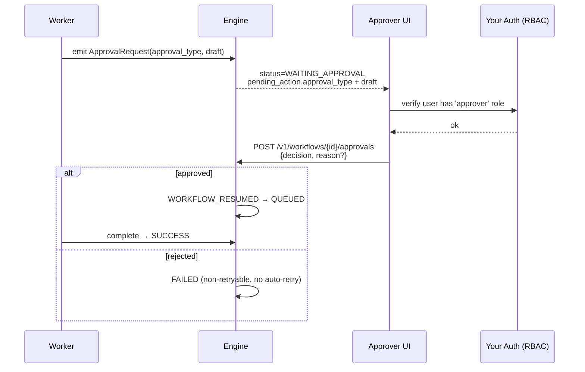

### 7.2 Exact request contract

**Endpoint.** `POST /v1/workflows/{workflow_id}/approvals`. This service does
not enforce who may call it — your gateway/UI is responsible for confirming
the caller is authorized to approve before making the request.
**Status codes.** `200 OK`,
`404 workflow_not_found`, `409 workflow_state_conflict` when the
`approval_type` doesn't match `pending_action.approval_type` or the
workflow is not in `WAITING_APPROVAL`.

**Approve:**

```http
POST /v1/workflows/d65cb4dc8e624d209344a41c1f7922dd/approvals
x-tenant-id: tenant_acme
x-principal-id: jane.doe@acme.com
Content-Type: application/json

{
  "tenant_id": "tenant_acme",
  "approval_type": "recruiter_send_approval",
  "decision": "approve",
  "approval_payload": {
    "comment": "Tone aligns with brand voice; safe to send",
    "reviewed_at": "2026-06-01T05:50:00Z"
  }
}
```

**Reject** (`reason` is **required** when `decision == "reject"`;
omission returns `422 validation_error`):

```json
{
  "tenant_id": "tenant_acme",
  "approval_type": "refund_approval",
  "decision": "reject",
  "reason": "Customer outside refund window per policy v2.1"
}
```

### 7.3 Standard `approval_type` values

| approval_type | Workflow | Recommended role |
|---------------|----------|------------------|
| `email_send_approval` | `email_workflow`, `email_reply_workflow` | comms lead |
| `recruiter_send_approval` | `recruiter_reply_workflow` | recruiting lead |
| `refund_approval` | `refund_workflow` | finance manager |
| `contract_review_approval` | `contract_review_workflow` | legal counsel |
| any custom | `approval_workflow` (tooling category) | tenant-defined |

Discover the actual `approval_type` per workflow via
`GET /v1/workflows` — the `approval_type` field is part of the spec.

### 7.4 Integrator checklist

- [ ] Map `approval_type` values to your role/permission model.
- [ ] Render the draft (`pending_action.draft` or `pending_action.payload`)
      before the approver acts. Never auto-approve from a bot.
- [ ] Capture `reason` on reject — it lands in the event log for audit
      and surfaces in `error.message` on the final `FAILED` snapshot.
- [ ] Treat `WAITING_APPROVAL` past SLA as an escalation signal in your
      ticketing/notification system.

---

## 8. Retry, timeout, and dead-letter

```mermaid
flowchart TD
    R[RUNNING] --> ERR{Error type?}
    ERR -->|network / 429 / 5xx / JSON parse| RETRY{attempts<br/>< max?}
    ERR -->|schema violation / 4xx / approval reject| FAIL[FAILED · non-retryable]
    RETRY -->|yes| SCH[RETRY_SCHEDULED<br/>delay = min(B·2^n, M) ± jitter]
    SCH --> QQ[QUEUED]
    RETRY -->|no| DEAD[DEAD<br/>visible in /v1/workflows/dead-letter]
    FAIL --> DEAD
    R --> TO[WORKFLOW_TIMEOUT<br/>now ≥ timeout_at]
    TO --> RETRY
    DEAD --> REPLAY[Operator: POST /dead-letter/replay]
    REPLAY --> QQ
```

Defaults (overridable per workflow and via `AI_PLATFORM_*` env):

| Knob | Default |
|------|---------|
| `max_attempts` | 3 |
| Initial backoff `B` | 5.0 s |
| Max backoff `M` | 300.0 s |
| Jitter ratio `J` | 0.1 |

Operator runbook for DLQ replay: [runbooks.md](runbooks.md).

---

## 9. Tenant isolation & multi-tenancy

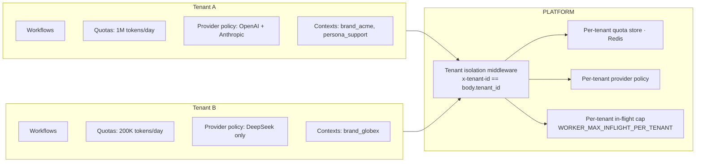

**Guarantees.**

- Every workflow row, event, queue entry, and context lookup is
  filtered by the `tenant_id` carried in request context (trusted from
  `x-tenant-id`, forwarded by your gateway; not re-validated by this
  service).
- One tenant exhausting quota cannot starve workers serving another
  tenant (in-flight fairness cap).
- Provider policy can restrict which LLMs a tenant is allowed to use
  (e.g. on-prem only, no US-hosted models for an EU tenant).

---

## 10. Integration checklist (end-to-end)

Use this as your go-live gate.

### Phase 1 — Connectivity
- [ ] Confirm `GET /health/ready` returns 200 from your backend host.
- [ ] Send `x-tenant-id`, `x-principal-id` on every request; your gateway is
      responsible for authenticating the caller and forwarding these
      correctly — see [authentication.md](authentication.md).
- [ ] Set `Idempotency-Key` on every POST that you may retry.

### Phase 2 — Discovery
- [ ] At startup, call `GET /v1/workflows` and cache the catalog
      (with TTL). Surface enabled workflows in your admin UI.
- [ ] Do **not** hardcode workflow names in business logic — read from
      the cached catalog.

### Phase 3 — First workflow
- [ ] Pick one workflow from §5 that maps to your use case.
- [ ] Submit a request, capture `workflow_id`, persist it against your
      domain record.
- [ ] Implement a poller (1 s → 3 s → 5 s backoff, cap at 30 s) or
      subscribe to SSE/WS.
- [ ] On `SUCCESS`, validate `result` against your expected schema
      before acting on it.

### Phase 4 — Tools & approvals
- [ ] For each workflow you use, list its `tool_names` and
      `approval_type` (from the discovery payload).
- [ ] Implement tool callbacks — one HTTP handler per tool, posting
      back to `/tool-results`.
- [ ] Build the approver UI for any approval-gated workflow you depend on,
      enforcing who may approve on your own side (this service does not).

### Phase 5 — Failure modes
- [ ] Handle all error codes from [api.md §3](api.md#3-error-envelope).
- [ ] Watch for `DEAD` workflows — schedule a daily DLQ review job.
- [ ] Alert on consecutive `WORKFLOW_TIMEOUT` events for a workflow.
- [ ] Test: kill Redis mid-workflow, kill worker mid-step, send malformed
      tool-result. All should recover or surface a clear error.

### Phase 6 — Observability
- [ ] Forward `trace_id` end-to-end (your logs ↔ platform logs).
- [ ] Scrape API and worker metrics into Prometheus. Use
  `docker-compose.observability.yml` plus the shipped assets under
  `monitoring/`, referenced from [observability-metrics.md](observability-metrics.md).
- [ ] Alarm on queue depth, retry rate, provider error rate.

### Phase 7 — Production hardening
- [ ] Per-tenant quotas configured.
- [ ] Per-tenant provider policy reviewed (data-residency, cost).
- [ ] Rate limits set (`AI_PLATFORM_RATE_LIMIT_*`).
- [ ] CORS, body-size limits reviewed.
- [ ] Load test against `load/k6-workflows.js` at expected peak.

---

## 11. Complete endpoint inventory

All endpoints are under base URL `http://<host>:8000` (or your TLS edge).
All request/response bodies are JSON unless noted.

### 11.1 Capability endpoints (HTTP 202 Accepted on success)

| Method | Path | Body | Permission |
|--------|------|------|------------|
| POST | `/v1/generate` | `AICommandRequest` | `run_workflow` |
| POST | `/v1/classify` | `AICommandRequest` | `run_workflow` |
| POST | `/v1/extract` | `AICommandRequest` | `run_workflow` |
| POST | `/v1/embed` | `AICommandRequest` | `run_workflow` |
| POST | `/v1/rerank` | `AICommandRequest` | `run_workflow` |
| POST | `/v1/summarize` | `AICommandRequest` | `run_workflow` |
| POST | `/v1/workflows/run` | `WorkflowRunRequest` (extends `AICommandRequest`; requires non-empty `payload`/`context`/`context_ids`) | `run_workflow` |

All return `QueuedWorkflowResponse`. The capability endpoints are
semantic aliases — the engine uses the `workflow` field to dispatch, the
path only affects metrics labels and OpenAPI `x-ai-capability`.

### 11.2 Workflow operations

| Method | Path | Body | Permission | Status codes |
|--------|------|------|------------|--------------|
| GET | `/v1/workflows/{workflow_id}?tenant_id=` | — | `read_workflow` | 200, 404 |
| GET | `/v1/jobs/{job_id}?tenant_id=` | — | `read_workflow` | 200, 404 |
| POST | `/v1/workflows/{workflow_id}/tool-results` | `ToolResultRequest` | `run_workflow` | 200, 404, 409 |
| POST | `/v1/workflows/{workflow_id}/approvals` | `ApprovalDecisionRequest` | `approve_workflow` | 200, 403, 404, 409 |
| DELETE | `/v1/workflows/{workflow_id}?tenant_id=&reason=` | — | `run_workflow` | 200, 404, 409 |
| GET | `/v1/workflows/dead-letter?tenant_id=&limit=` (1–500, default 100) | — | `manage_dead_letter` | 200 |
| POST | `/v1/workflows/{workflow_id}/dead-letter/replay` | `DeadLetterReplayRequest` | `manage_dead_letter` | 200, 404, 409 |
| GET | `/v1/workflows?category=&enabled_only=` | — | (none / open) | 200 |

### 11.3 Real-time subscriptions

| Method | Path | Notes |
|--------|------|-------|
| GET | `/v1/realtime/workflows/{workflow_id}/events?tenant_id=` | SSE; `Content-Type: text/event-stream`; emits `workflow.snapshot`, `workflow.event`, `workflow.completed` |
| WS | `/v1/realtime/workflows/{workflow_id}/ws?tenant_id=` | WebSocket; closes `WS_1008` on tenant mismatch, `WS_1011` on internal error |

### 11.4 Inbound channel webhooks

These endpoints accept inbound messages from channel providers and
automatically dispatch them through the matching workflow.

| Method | Path | Mapped workflow |
|--------|------|-----------------|
| POST | `/v1/webhooks/telegram` | `telegram_workflow` |
| POST | `/v1/webhooks/whatsapp` | `whatsapp_workflow` |
| POST | `/v1/webhooks/email` | `email_reply_workflow` |

Body is `WebhookIngressRequest`:

```json
{
  "tenant_id": "tenant_acme",
  "event_id": "telegram-update-9981",
  "context_ids": ["brand_acme_v3"],
  "payload": {
    "message": { "text": "Where is my order?" },
    "chat": { "id": "12345" }
  }
}
```

Platform returns `QueuedWorkflowResponse` like any other submit.

### 11.5 Multi-agent orchestration

| Method | Path | Notes |
|--------|------|-------|
| POST | `/v1/agents/orchestrations` | Queue several workflows as one persisted unit |
| GET | `/v1/agents/orchestrations/{orchestration_id}` | Aggregated status of all child workflows |

### 11.6 Tenant memory (conversation / episodic / semantic)

Under `/v1/memory`. See [context-management.md](context-management.md).

| Method | Path | Purpose |
|--------|------|---------|
| POST | `/v1/memory/conversation` | Append message to a conversation thread |
| POST | `/v1/memory/episodic` | Store a discrete event/episode |
| POST | `/v1/memory/semantic` | Store an embedding-backed fact |
| POST | `/v1/memory/recall` | Hybrid recall by tenant + thread + query |
| GET | `/v1/memory/conversation/{thread_id}?tenant_id=` | Fetch conversation history |

### 11.7 Documents (RAG corpus)

| Method | Path | Purpose |
|--------|------|---------|
| POST | `/v1/documents` | Ingest a document for RAG (chunks + embeds) |
| DELETE | `/v1/documents/{document_id}` | Remove a document |

### 11.8 Health & observability

| Method | Path | Status codes |
|--------|------|--------------|
| GET | `/health` | 200 / 503 (aggregate) |
| GET | `/health/live` | 200 always (liveness) |
| GET | `/health/ready` | 200 / 503 (readiness incl. workflow_worker heartbeat) |
| GET | `/metrics` | 200 `text/plain; version=0.0.4` (Prometheus) |

---

## 12. Error code matrix

All error responses use `ErrorResponse`:

```json
{
  "success": false,
  "trace_id": "01HX2N5G6E0X4Z7V8YQK0V8RPT",
  "error": {
    "code": "validation_error",
    "message": "workflow name 'foo bar' must be a lower_snake_case identifier",
    "details": { "field": "workflow" }
  }
}
```

| HTTP | `error.code` | When | Client action |
|------|--------------|------|---------------|
| 401 / 403 | — | Returned by your API gateway, not this service (auth is enforced upstream) | Check gateway logs/config |
| 404 | `workflow_not_found` | Unknown / unregistered / disabled workflow, or `workflow_id` not in this tenant | Refresh `GET /v1/workflows`; verify tenant scope |
| 404 | `job_not_found` | `job_id` not in this tenant | Use `workflow_id` instead, or verify tenant |
| 409 | `idempotency_key_conflict` | Same `Idempotency-Key`, different body | Pick a new key or send identical body |
| 409 | `idempotency_key_in_progress` | First request still running | Wait + retry, or poll original `workflow_id` |
| 409 | `workflow_state_conflict` | Callback / cancel / replay against wrong state | Re-fetch status; only act on matching `pending_action` |
| 422 | `validation_error` | Pydantic / payload-size / depth / range violation | Fix offending field; `details.field` points to it |
| 429 | `quota_exceeded` | Tenant token, RPM, or cost quota hit | Backoff; check tenant quota config |
| 503 | `service_unavailable` | Readiness component degraded (DB, Redis, worker heartbeat) | Retry with backoff; alert on persistent 503 |

---

## 13. `WorkflowState` reference

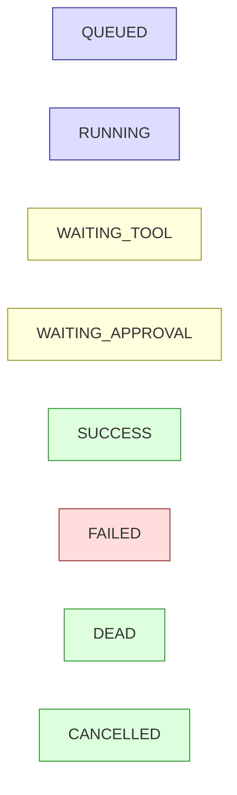

| State | Terminal? | `pending_action` populated? | `result` populated? | `error` populated? |
|-------|-----------|-----------------------------|--------------------|--------------------|
| `QUEUED` | no | no | no | no |
| `RUNNING` | no | no | no | no |
| `WAITING_TOOL` | no | **yes** (`tool_name`, `tool_call_id`, `arguments`) | no | no |
| `WAITING_APPROVAL` | no | **yes** (`approval_type`, `draft`/`payload`) | no | no |
| `SUCCESS` | **yes** | no | **yes** | no |
| `FAILED` | no (retries) | no | no | **yes** |
| `DEAD` | **yes** | no | no | **yes** |
| `CANCELLED` | **yes** | no | no | optional |

Clients can treat `SUCCESS`, `DEAD`, `CANCELLED` as final and stop
polling. `FAILED` may transition back to `QUEUED` via the retry engine.

---

## 14. End-to-end integration walkthrough (curl)

Replaces a single business case end-to-end against a running platform.
Assumes `BASE=http://localhost:8000`, `TENANT=tenant_acme`,
`PRIN=svc-support`.

### Step 1 — discover workflows

```bash
curl -s "$BASE/v1/workflows?category=communication&enabled_only=true" \
  -H "x-tenant-id: $TENANT" | jq '.workflows[] | {workflow_name, approval_type, tool_names}'
```

### Step 2 — submit an email reply

```bash
WFID=$(curl -s -X POST "$BASE/v1/workflows/run" \
  -H "Content-Type: application/json" \
  -H "x-tenant-id: $TENANT" \
  -H "x-principal-id: $PRIN" \
  -H "Idempotency-Key: $(uuidgen)" \
  -d '{
    "tenant_id": "'"$TENANT"'",
    "workflow": "email_reply_workflow",
    "task": "draft_reply",
    "payload": {
      "thread": [{"from": "ada@buyer.com", "body": "Where is order 8821?"}],
      "channel": "email"
    }
  }' | jq -r .workflow_id)
echo "workflow_id=$WFID"
```

### Step 3 — poll until terminal or pending

```bash
while true; do
  STATE=$(curl -s "$BASE/v1/workflows/$WFID?tenant_id=$TENANT" \
    -H "x-tenant-id: $TENANT" | jq -r .status)
  echo "state=$STATE"
  case "$STATE" in
    SUCCESS|FAILED|DEAD|CANCELLED|WAITING_TOOL|WAITING_APPROVAL) break;;
  esac
  sleep 2
done
```

### Step 4 — resolve the approval (if `email_send_approval` configured)

```bash
curl -s -X POST "$BASE/v1/workflows/$WFID/approvals" \
  -H "Content-Type: application/json" \
  -H "x-tenant-id: $TENANT" \
  -H "x-principal-id: jane@acme.com" \
  -d '{
    "tenant_id": "'"$TENANT"'",
    "approval_type": "email_send_approval",
    "decision": "approve",
    "approval_payload": {"comment": "Reviewed, safe to send"}
  }'
```

### Step 5 — consume the result

```bash
curl -s "$BASE/v1/workflows/$WFID?tenant_id=$TENANT" \
  -H "x-tenant-id: $TENANT" | jq '.result'
```

### Step 6 — if it ended up `DEAD`, replay it

```bash
curl -s -X POST "$BASE/v1/workflows/$WFID/dead-letter/replay" \
  -H "Content-Type: application/json" \
  -H "x-tenant-id: $TENANT" \
  -H "x-principal-id: ops@acme.com" \
  -d '{
    "tenant_id": "'"$TENANT"'",
    "reason": "transient provider outage resolved",
    "reset_attempts": true
  }'
```

---

## 15. Reference map

| Need | Read |
|------|------|
| HTTP contract details | [api.md](api.md) |
| End-to-end code samples (Node, Python, curl) | [integration-guide.md](integration-guide.md), [sdk-examples.md](sdk-examples.md) |
| Workflow lifecycle, retry math, discovery | [workflows.md](workflows.md) |
| How tool callbacks work | [tool-calls.md](tool-calls.md) |
| Identity headers and trust model | [authentication.md](authentication.md) |
| Provider routing rules and overrides | [provider-routing.md](provider-routing.md) |
| Building a new plugin workflow | [custom-workflow-cookbook.md](custom-workflow-cookbook.md) |
| Events emitted on each transition | [event-model.md](event-model.md) |
| Connectivity / deployment topology | [integration-architecture.md](integration-architecture.md) |
| Metrics and SLOs | [observability-metrics.md](observability-metrics.md) |
| Operator playbooks (DLQ, incidents) | [runbooks.md](runbooks.md) |
| Outbound webhook delivery & retry | [webhooks.md](webhooks.md) |
