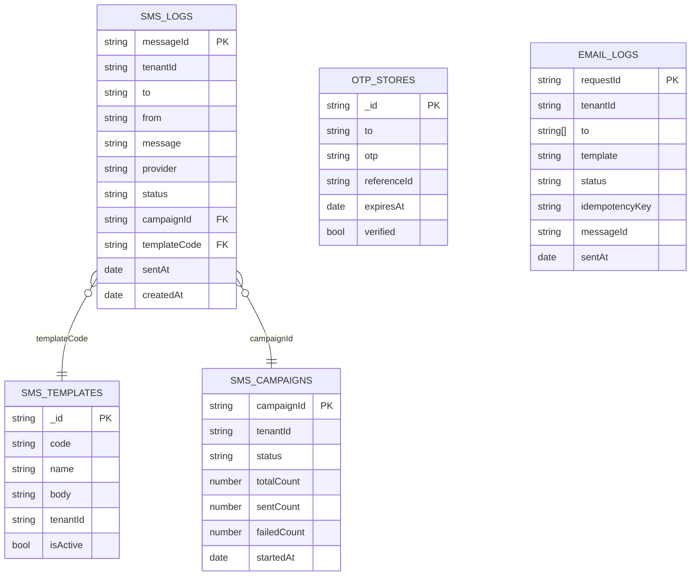

# Database

The service uses **MongoDB** (via Mongoose 8.5) as its sole persistence store. All collections are prefixed with the collection name — no schema-level database prefixing is applied.

---

## Collections

### `sms_logs`

Stores every outbound SMS message and its full delivery lifecycle.

| Field | Type | Required | Description |
|---|---|---|---|
| `messageId` | String | Yes | UUID assigned on creation (unique) |
| `tenantId` | String | Yes | Tenant identifier |
| `to` | String | Yes | Normalised recipient phone number |
| `from` | String | No | Sender ID or number |
| `message` | String | No | Actual message body sent |
| `templateId` | ObjectId | No | Reference to SMS template |
| `templateCode` | String | No | Template code used |
| `provider` | String | No | Provider name that sent the message |
| `providerMessageId` | String | No | Provider-assigned message ID |
| `status` | Enum | Yes | See [SMS Status Values](#sms-status-values) |
| `messageType` | Enum | No | `TRANSACTIONAL`, `PROMOTIONAL`, `OTP`, `FLASH` |
| `segmentCount` | Number | No | Number of SMS segments |
| `cost` | Number | No | Cost per message |
| `currency` | String | No | Currency code (e.g. `INR`, `USD`) |
| `referenceId` | String | No | Caller-provided deduplication reference |
| `dltTemplateId` | String | No | TRAI DLT Template ID |
| `dltEntityId` | String | No | TRAI DLT Entity ID |
| `unicode` | Boolean | No | Whether message was sent as Unicode |
| `dlrReceived` | Boolean | No | Whether a DLR webhook was received |
| `dlrTimestamp` | Date | No | Timestamp of DLR receipt |
| `dlrPayload` | Mixed | No | Raw DLR payload from provider |
| `errorCode` | String | No | Provider error code on failure |
| `errorMessage` | String | No | Error description |
| `campaignId` | String | No | Bulk campaign ID |
| `attempts` | Array | No | Per-attempt metadata (provider, status, timestamp) |
| `statusHistory` | Array | No | Full status transition history |
| `retryCount` | Number | No | Number of retry attempts made |
| `nextRetryAt` | Date | No | Scheduled time for next retry |
| `metadata` | Mixed | No | Caller-provided arbitrary metadata |
| `gdprPurgedAt` | Date | No | Timestamp of GDPR purge (PII removed) |
| `sentAt` | Date | No | When the message was accepted by provider |
| `deliveredAt` | Date | No | When DLR confirmed delivery |
| `createdAt` | Date | Auto | Mongoose timestamp |
| `updatedAt` | Date | Auto | Mongoose timestamp |

**Indexes:**

```
{ tenantId: 1, status: 1, createdAt: -1 }   compound
{ tenantId: 1, provider: 1, createdAt: -1 } compound
{ tenantId: 1, createdAt: -1 }              compound
{ tenantId: 1, referenceId: 1 }             compound
{ messageId: 1 }                            unique
{ campaignId: 1 }
{ nextRetryAt: 1 }  (sparse)
```

---

### `sms_templates`

User-created SMS templates scoped per tenant.

| Field | Type | Required | Description |
|---|---|---|---|
| `name` | String | Yes | Template display name |
| `code` | String | Yes | Uppercase code (auto-generated if not provided) |
| `body` | String | Yes | Template body with `{{variable}}` placeholders |
| `variables` | [String] | Auto | Variable names extracted from body |
| `category` | Enum | No | `TRANSACTIONAL`, `PROMOTIONAL`, `OTP` |
| `dltTemplateId` | String | No | TRAI DLT Template ID |
| `dltEntityId` | String | No | TRAI DLT Entity ID |
| `senderId` | String | No | Default sender for this template |
| `tenantId` | String | No | Tenant identifier |
| `isActive` | Boolean | No | `true` by default |
| `isDeleted` | Boolean | No | Soft-delete flag |
| `deletedAt` | Date | No | Soft-delete timestamp |
| `createdAt` | Date | Auto | Mongoose timestamp |
| `updatedAt` | Date | Auto | Mongoose timestamp |

**Indexes:**

```
{ code: 1, tenantId: 1 }    unique compound
{ name: 1, tenantId: 1 }    unique compound
```

---

### `sms_campaigns`

Bulk SMS campaign tracking records.

| Field | Type | Required | Description |
|---|---|---|---|
| `campaignId` | String | Yes | UUID (unique) |
| `name` | String | No | Campaign display name |
| `status` | Enum | Yes | `DRAFT`, `SCHEDULED`, `IN_PROGRESS`, `COMPLETED`, `PAUSED`, `CANCELLED` |
| `totalCount` | Number | No | Total recipient count |
| `sentCount` | Number | No | Successfully sent count |
| `deliveredCount` | Number | No | Confirmed delivered count |
| `failedCount` | Number | No | Failed count |
| `templateCode` | String | No | Template used |
| `messageType` | String | No | Message type |
| `tenantId` | String | No | Tenant identifier |
| `startedAt` | Date | No | When batch processing started |
| `completedAt` | Date | No | When all batches completed |
| `metadata` | Mixed | No | Extra metadata |
| `createdAt` | Date | Auto | Mongoose timestamp |

**Indexes:**

```
{ campaignId: 1 }    unique
{ tenantId: 1 }
{ status: 1 }
```

---

### `otp_stores`

Temporary OTP records. Automatically expire via MongoDB TTL index.

| Field | Type | Required | Description |
|---|---|---|---|
| `to` | String | Yes | Phone number |
| `otp` | String | Yes | The OTP value (plain text) |
| `referenceId` | String | Yes | UUID reference ID |
| `expiresAt` | Date | Yes | OTP expiry time |
| `verified` | Boolean | No | Whether OTP has been verified |
| `tenantId` | String | No | Tenant identifier |
| `createdAt` | Date | Auto | Mongoose timestamp |

**Indexes:**

```
{ expiresAt: 1 }    TTL index — auto-deletes after expiry + 1 hour
{ to: 1, tenantId: 1 }
{ referenceId: 1 }  unique
```

> OTP documents are automatically deleted 1 hour after `expiresAt`. The TTL index uses `expireAfterSeconds: 3600`.

---

### `email_logs`

Email delivery logs with idempotency support.

| Field | Type | Required | Description |
|---|---|---|---|
| `requestId` | String | Yes | UUID assigned on creation (unique) |
| `tenantId` | String | Yes | Tenant identifier |
| `to` | [String] | Yes | Recipient email addresses |
| `cc` | [String] | No | CC recipients |
| `bcc` | [String] | No | BCC recipients |
| `from` | String | No | Sender email address |
| `fromName` | String | No | Sender display name |
| `subject` | String | No | Email subject |
| `template` | String | No | Template name used |
| `templateId` | String | No | Custom template ID |
| `status` | Enum | No | `queued`, `sent`, `failed`, `retrying` |
| `messageId` | String | No | SMTP message ID returned by server |
| `idempotencyKey` | String | No | Deduplication key |
| `errorMessage` | String | No | Error description on failure |
| `metadata` | Mixed | No | Caller-provided metadata |
| `sentAt` | Date | No | SMTP acceptance timestamp |
| `createdAt` | Date | Auto | Mongoose timestamp |
| `updatedAt` | Date | Auto | Mongoose timestamp |

**Indexes:**

```
{ tenantId: 1, idempotencyKey: 1 }    unique compound (sparse)
{ requestId: 1 }                       unique
{ tenantId: 1, createdAt: -1 }
{ status: 1 }
```

---

### `notification_logs`

Generic notification log schema (shared/models layer).

| Field | Type | Required | Description |
|---|---|---|---|
| `tenantId` | String | Yes | Tenant identifier |
| `channel` | Enum | Yes | `sms`, `email`, `push`, `in_app` |
| `status` | Enum | Yes | `queued`, `sent`, `delivered`, `failed` |
| `recipient` | String | Yes | Recipient address |
| `payload` | Mixed | No | Full notification payload |
| `provider` | String | No | Provider used |
| `error` | String | No | Error message |
| `createdAt` | Date | Auto | Mongoose timestamp |

---

## ER Diagram



---

## SMS Status Values

| Status | Description |
|---|---|
| `QUEUED` | Accepted but not yet dispatched |
| `SENDING` | Dispatch in progress |
| `SENT` | Accepted by provider |
| `DELIVERED` | DLR confirmation received |
| `FAILED` | Permanent failure |
| `UNDELIVERED` | Provider could not deliver |
| `REJECTED` | Provider rejected the message |
| `RETRYING` | Scheduled for retry by background worker |
| `UNKNOWN` | Status not determinable |
| `PURGED` | PII erased by GDPR purge |

---

## Connection Configuration

```env
MONGODB_URI=mongodb://localhost:27017/notification_service
```

The MongoDB connection is established once at application startup via `database.module.ts`. All Mongoose models are registered globally and shared across modules.

---

## Indexes for Performance

The compound index `{ tenantId, status, createdAt }` on `sms_logs` supports the most common queries:
- Retry worker queries: `{ tenantId, status: 'RETRYING', nextRetryAt: { $lte: now } }`
- Analytics queries: `{ tenantId, createdAt: { $gte: from, $lte: to } }`
- Provider health queries: `{ tenantId, provider, createdAt: { $gte: yesterday } }`

The `{ tenantId, idempotencyKey }` unique index on `email_logs` enforces at-most-once email delivery per idempotency key per tenant.
