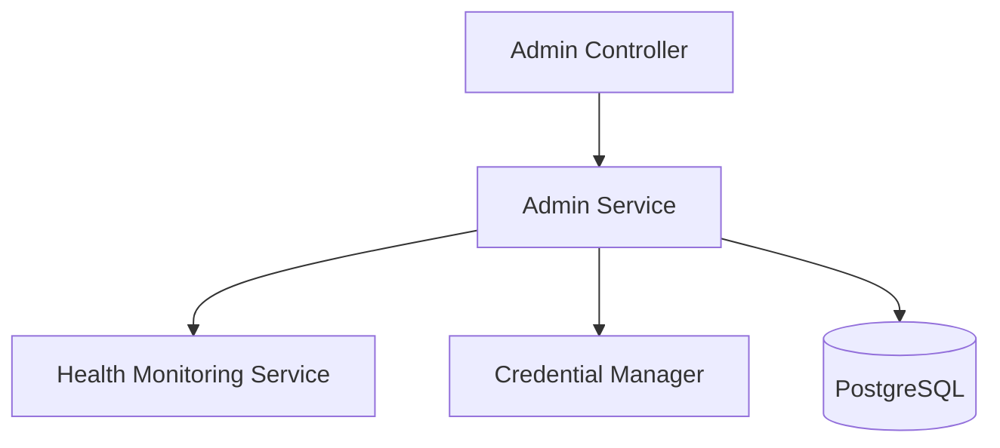
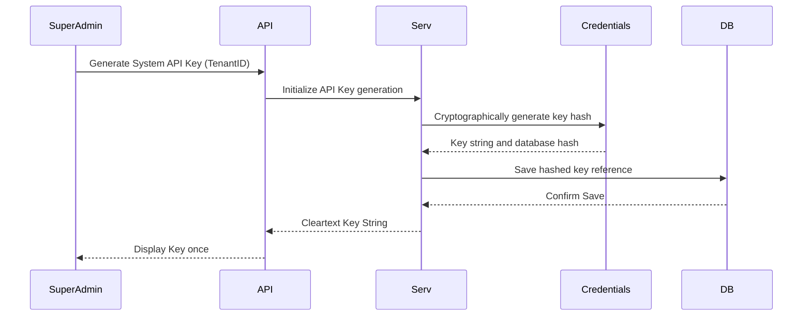
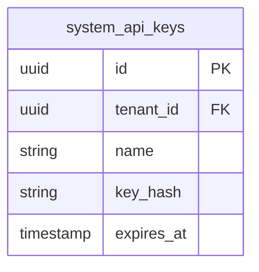

# SYSTEM DOCUMENTATION: ADMIN MODULE

---

## 1. MODULE OVERVIEW

### 1.1 Purpose & Responsibilities
Provides system health monitoring dashboards, api credential key generation, external webhook target registrations, operational auditing tables, and database migrations control.

### 1.2 Dependencies & Owned Tables
* **Dependencies**: Foundation, Security.
* **Owned Tables**: `system_api_keys`, `system_webhook_subscriptions`.

### 1.3 Diagrams

#### Component Diagram


#### Sequence Diagram


#### ER Diagram


---

## 2. BUSINESS FLOWS

### 2.1 API Key Verification
* **Trigger**: API call with header `x-api-key`.
* **Processing**: Hashes incoming key. Queries `system_api_keys` for a matching hash and verifies expiration. Sets Tenant context corresponding to the key record.
* **Failure Handling**: Rejects request with HTTP 401 Unauthorized if hash is missing or expired.

---

## 3. DATA MODEL
```sql
CREATE TABLE ai_support_agent.system_api_keys (
    id UUID PRIMARY KEY DEFAULT gen_random_uuid(),
    tenant_id UUID NOT NULL,
    name VARCHAR(100) NOT NULL,
    key_hash VARCHAR(64) NOT NULL UNIQUE,
    expires_at TIMESTAMP WITH TIME ZONE,
    created_at TIMESTAMP WITH TIME ZONE DEFAULT CURRENT_TIMESTAMP
);
```

---

## 4. API & EVENT DOCUMENTATION
* `POST /v1/admin/api-keys/generate`:
  - Request: `{"name": "production-sync-key", "tenantId": "uuid"}`
  - Response: Cleartext key and expiry metadata.
  - Permissions: `sysadmin:write`
