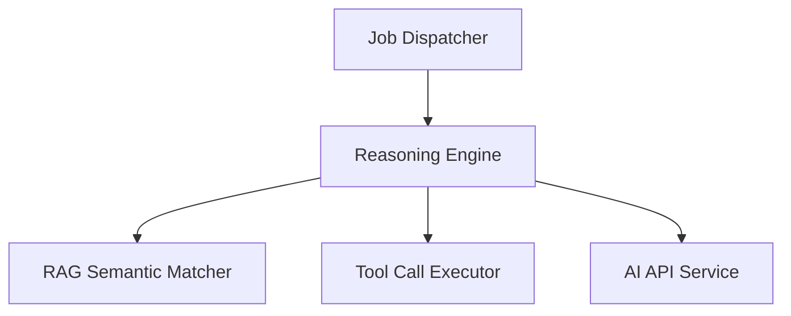
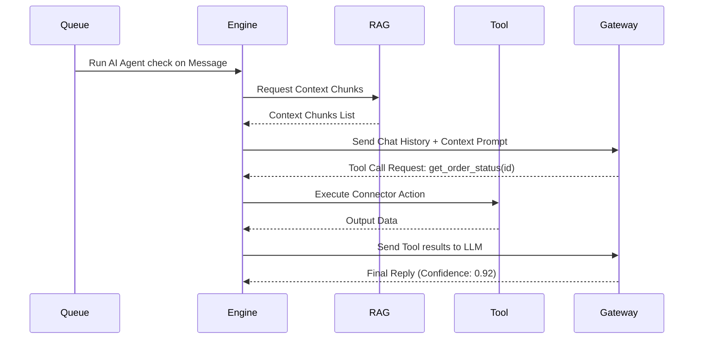
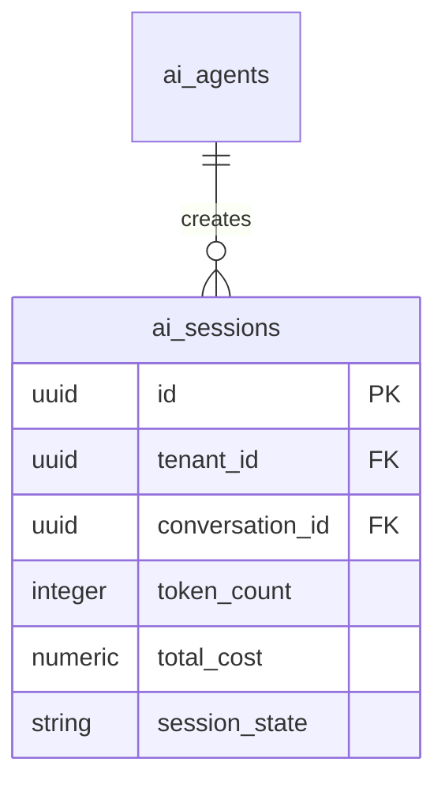
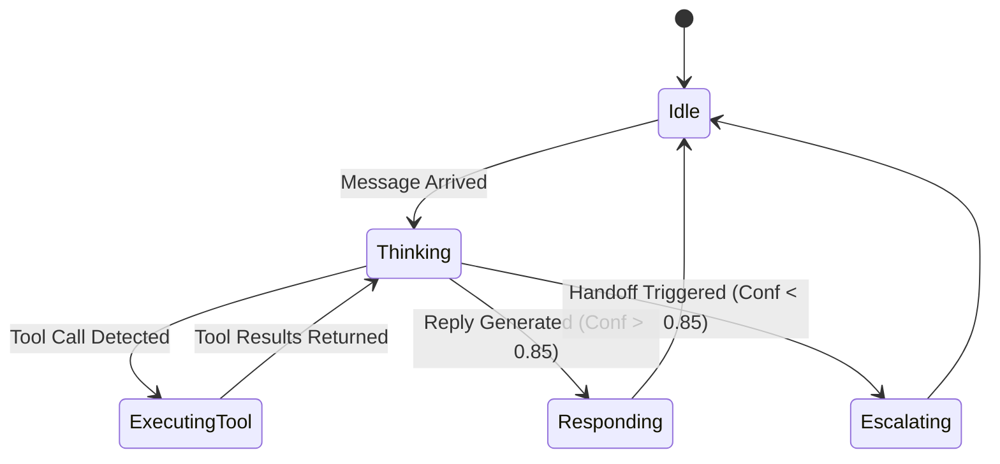
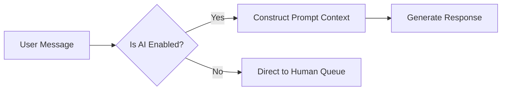

# SYSTEM DOCUMENTATION: AI INTEGRATION MODULE

---

## 1. MODULE OVERVIEW

### 1.1 Purpose & Responsibilities
Executes RAG prompts, selects and runs dynamic workflow tools, orchestrates conversational agent reasoning, controls human handoff triggers on low confidence, and tracks token consumption costs.

### 1.2 Dependencies & Owned Tables
* **Dependencies**: Foundation, Connector, Knowledge, Message.
* **Owned Tables**: `ai_agents`, `ai_sessions`, `ai_workflows`.

### 1.3 Diagrams

#### Component Diagram


#### Sequence Diagram


#### ER Diagram


#### State Diagram


#### Request Flow Diagram


---

## 2. BUSINESS FLOWS

### 2.1 Agent Message Loop & Handoff
* **Trigger**: `MESSAGE_SENT` event.
* **Processing**: Fetches the last 5 messages in conversation. Searches Knowledge Base for context. Sends payload to LLM. If confidence score < 0.85 or model returns a specific handoff tag, switches conversation assignment status to `ASSIGNED` and sends alert to the team queue.
* **Output**: Generated message response or human ticket routing.

---

## 3. DATA MODEL
```sql
CREATE TABLE ai_support_agent.ai_sessions (
    id UUID PRIMARY KEY DEFAULT gen_random_uuid(),
    tenant_id UUID NOT NULL,
    conversation_id UUID NOT NULL REFERENCES ai_support_agent.conversations(id),
    token_count INT DEFAULT 0,
    total_cost NUMERIC(10, 4) DEFAULT 0.0000,
    session_state VARCHAR(20) DEFAULT 'ACTIVE'
);
```

---

## 4. API & EVENT DOCUMENTATION
* `POST /v1/ai/session/:id/pause`:
  - Request: Empty body.
  - Response: `{"paused": true}`
  - Permissions: `conversation:write`
