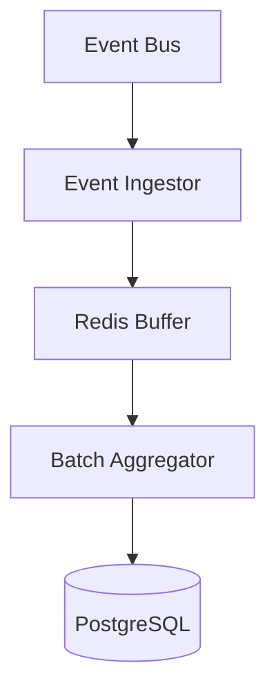
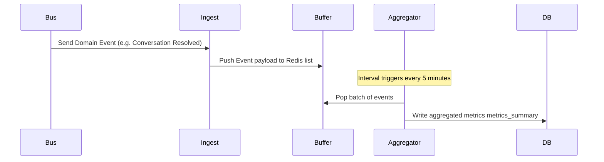
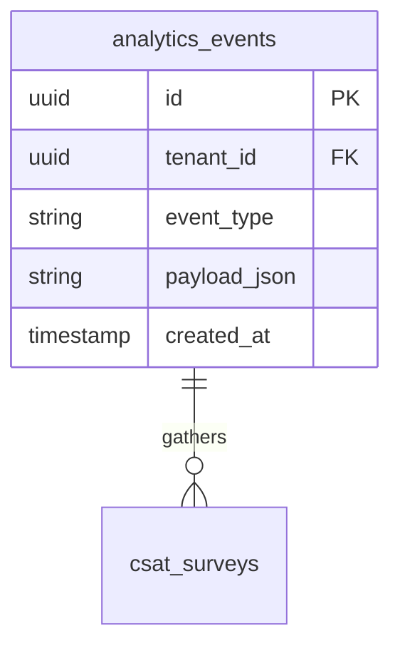
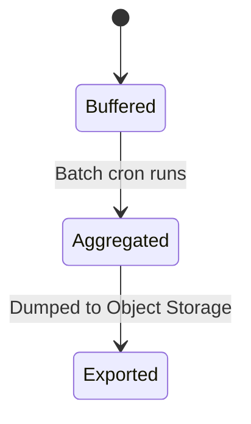
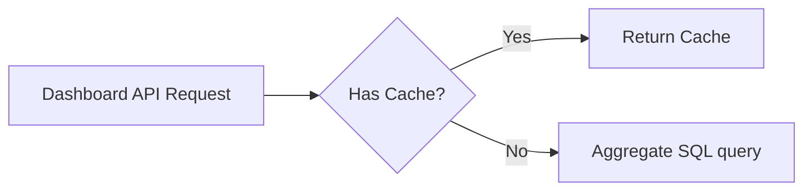

# SYSTEM DOCUMENTATION: ANALYTICS MODULE

---

## 1. MODULE OVERVIEW

### 1.1 Purpose & Responsibilities
Provides event-driven reporting. It aggregates conversation throughput, ticket resolution times, AI token usage, SLA breach statistics, and outputs periodic dashboard metrics.

### 1.2 Dependencies & Owned Tables
* **Dependencies**: Foundation, Postgres, Redis (for real-time metrics buffering).
* **Owned Tables**: `analytics_events`, `csat_surveys`.

### 1.3 Diagrams

#### Component Diagram


#### Sequence Diagram


#### ER Diagram


#### State Diagram


#### Request Flow Diagram


---

## 2. BUSINESS FLOWS

### 2.1 Batch Metrics Aggregation
* **Trigger**: 5-minute interval timer.
* **Processing**: Reads raw events from `analytics_events` table since the last processing checkpoint. Groups metrics by tenant, agent, and channel. Computes average resolution times and CSAT ratings. Updates the analytics summary cache.
* **Output**: Aggregated data tables for dashboards.

---

## 3. DATA MODEL
```sql
CREATE TABLE ai_support_agent.analytics_events (
    id UUID PRIMARY KEY DEFAULT gen_random_uuid(),
    tenant_id UUID NOT NULL,
    event_type VARCHAR(50) NOT NULL,
    payload_json JSONB NOT NULL,
    created_at TIMESTAMP WITH TIME ZONE DEFAULT CURRENT_TIMESTAMP
);

CREATE INDEX idx_analytics_events_type ON ai_support_agent.analytics_events(tenant_id, event_type, created_at);
```

---

## 4. API & EVENT DOCUMENTATION
* `GET /v1/analytics/dashboard/summary`:
  - Request: Query filters (startDate, endDate).
  - Response: Grouped metrics summary JSON.
  - Permissions: `analytics:read`
