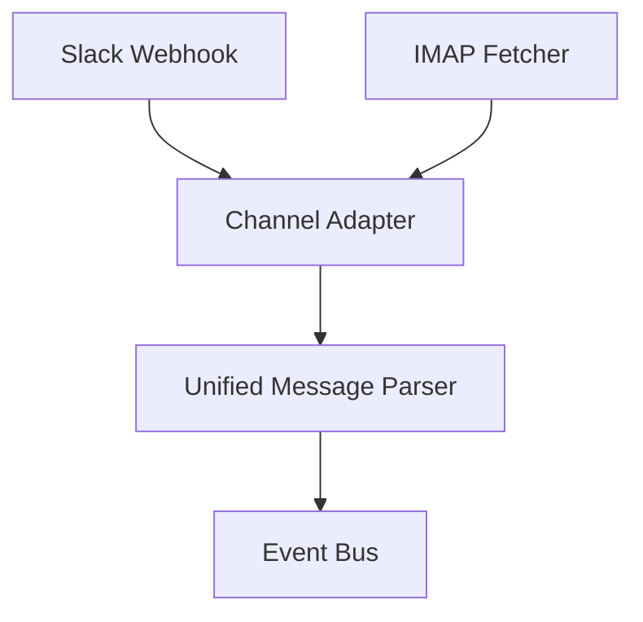
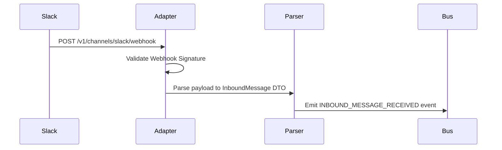
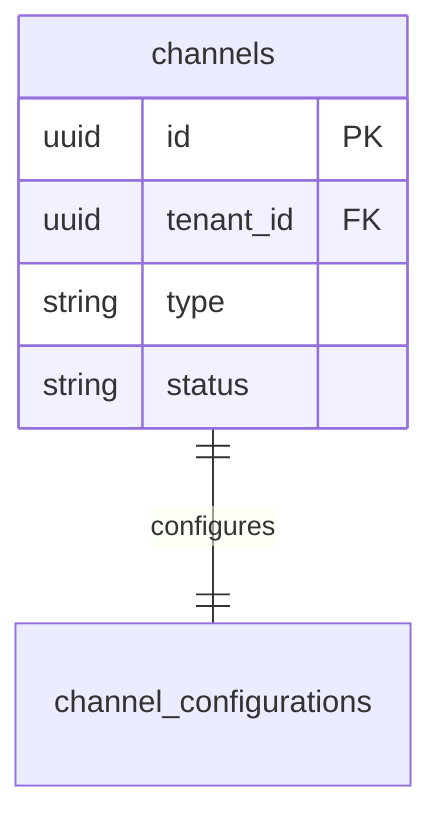
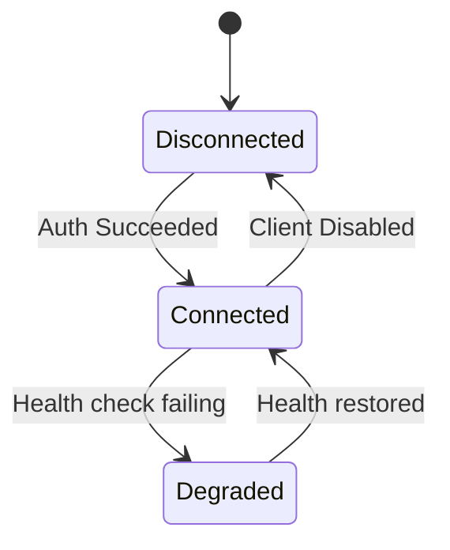
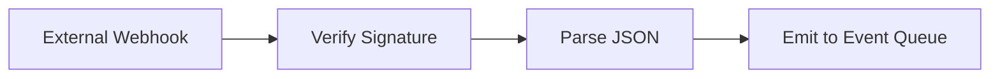

# SYSTEM DOCUMENTATION: CHANNEL MODULE

---

## 1. MODULE OVERVIEW

### 1.1 Purpose & Responsibilities
Provides communication adapters for third-party networks (Slack, WhatsApp, Email, Telegram, Teams), maps inbound messages to standard formats, validates incoming webhook signatures, and throttles outgoing API calls.

### 1.2 Dependencies & Owned Tables
* **Dependencies**: Foundation, Security (for webhook signature validation).
* **Owned Tables**: `channels`, `channel_configurations`.

### 1.3 Diagrams

#### Component Diagram


#### Sequence Diagram


#### ER Diagram


#### State Diagram


#### Request Flow Diagram


---

## 2. BUSINESS FLOWS

### 2.1 Inbound Webhook Parsing
* **Trigger**: Post request received on `/v1/channels/:type/webhook`.
* **Processing**: Fetches the channel's decryption keys/secrets. Verifies timestamp and checksum. Translates custom payload (e.g. Slack blocks) to the Support AI canonical message structure.
* **Output**: `INBOUND_MESSAGE_RECEIVED` event published to RabbitMQ/BullMQ.
* **Failure Handling**: Logs failure details to `connector_logs` and rejects with HTTP 401/400.

---

## 3. DATA MODEL
```sql
CREATE TABLE ai_support_agent.channels (
    id UUID PRIMARY KEY DEFAULT gen_random_uuid(),
    tenant_id UUID NOT NULL,
    type VARCHAR(30) NOT NULL, -- 'SLACK', 'WHATSAPP', 'EMAIL', etc.
    status VARCHAR(20) DEFAULT 'DISCONNECTED',
    created_at TIMESTAMP WITH TIME ZONE DEFAULT CURRENT_TIMESTAMP
);
```

---

## 4. API & EVENT DOCUMENTATION
* `POST /v1/channels/:type/webhook`:
  - Request: Context-dependent raw body.
  - Response: `{"received": true}`
  - Permissions: Public (secured via signature check).
