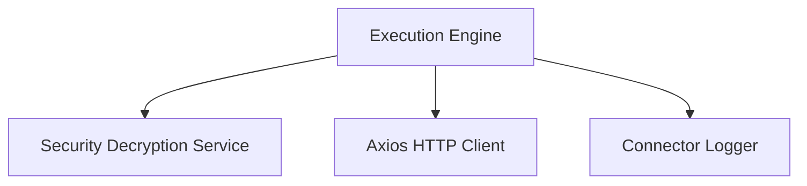
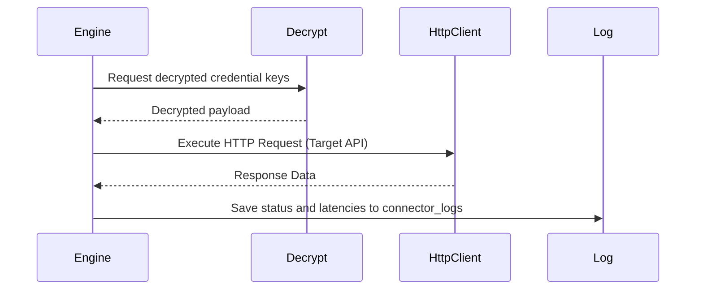
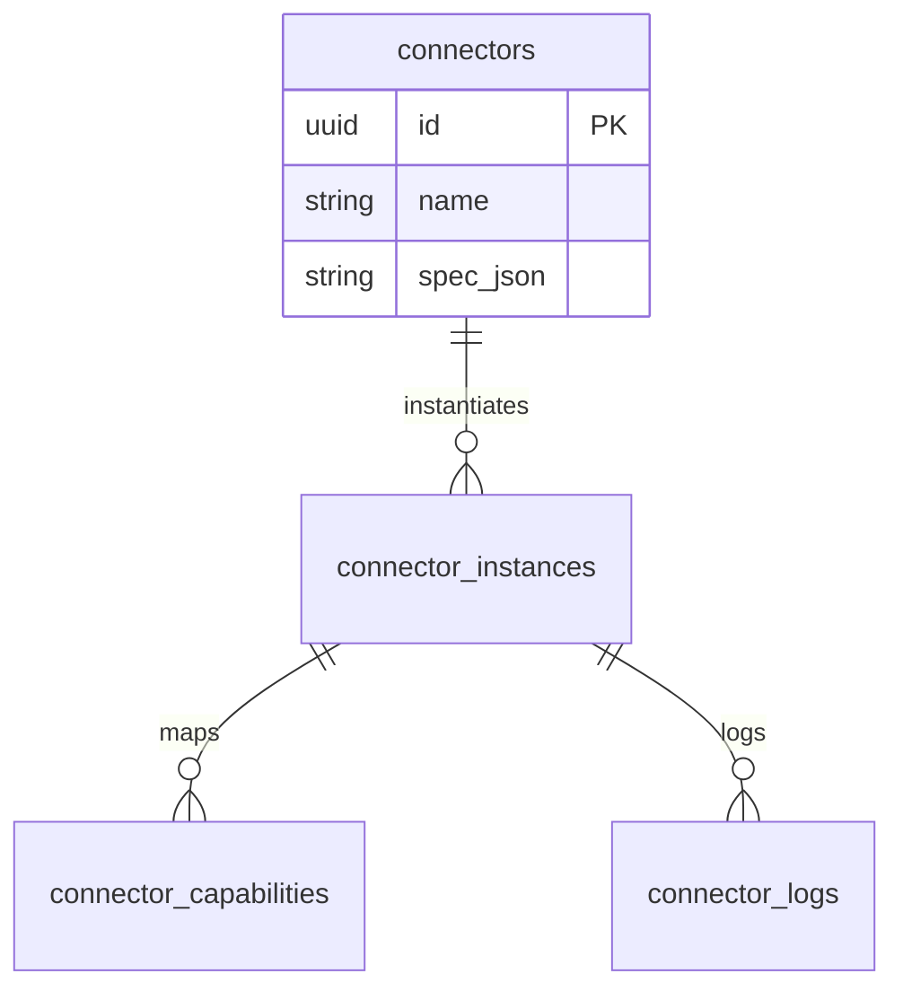
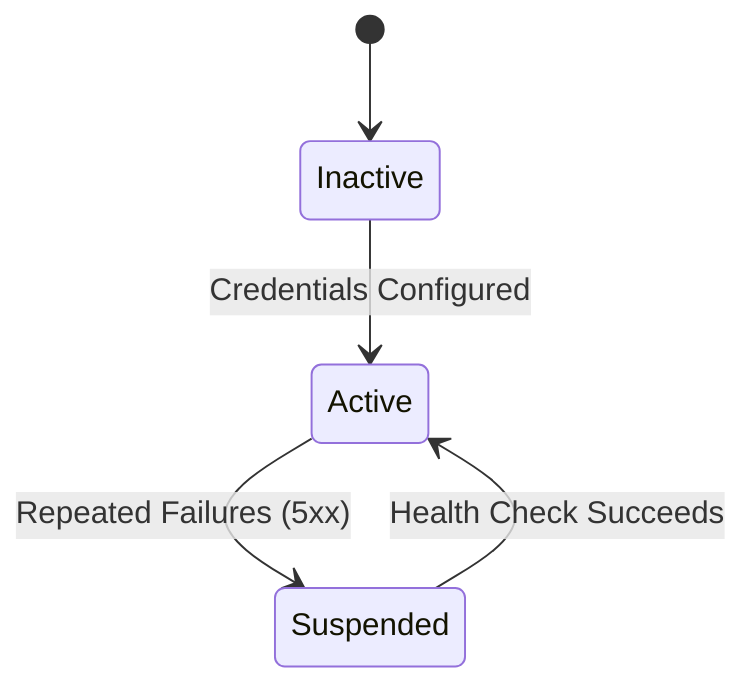
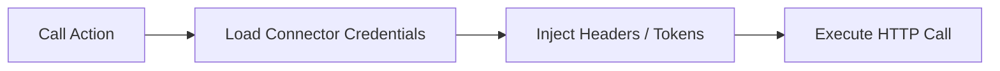

# SYSTEM DOCUMENTATION: CONNECTOR MODULE

---

## 1. MODULE OVERVIEW

### 1.1 Purpose & Responsibilities
Provides a dynamic integration gateway. It parses OpenAPI/Swagger specifications, tracks credential keys/tokens (AES encrypted), maps target endpoints to application actions, and handles API retry logic.

### 1.2 Dependencies & Owned Tables
* **Dependencies**: Foundation, Security (for encryption of tokens).
* **Owned Tables**: `connectors`, `connector_instances`, `connector_capabilities`, `connector_logs`.

### 1.3 Diagrams

#### Component Diagram


#### Sequence Diagram


#### ER Diagram


#### State Diagram


#### Request Flow Diagram


---

## 2. BUSINESS FLOWS

### 2.1 Dynamic Action Execution
* **Trigger**: Workflow action or AI tool execution call.
* **Processing**: Resolves target capability matching the action. Decrypts credentials. Compiles parameters and path templates. Issues HTTP request with automated retries (exponential backoff).
* **Output**: API payload return data.
* **Failure Handling**: Moves job to DLQ after 5 attempts; logs details in `connector_logs`.

---

## 3. DATA MODEL
```sql
CREATE TABLE ai_support_agent.connectors (
    id UUID PRIMARY KEY DEFAULT gen_random_uuid(),
    name VARCHAR(100) NOT NULL,
    spec_json JSONB NOT NULL
);

CREATE TABLE ai_support_agent.connector_instances (
    id UUID PRIMARY KEY DEFAULT gen_random_uuid(),
    tenant_id UUID NOT NULL,
    connector_id UUID NOT NULL REFERENCES ai_support_agent.connectors(id),
    encrypted_credentials TEXT NOT NULL,
    status VARCHAR(20) DEFAULT 'ACTIVE'
);
```

---

## 4. API & EVENT DOCUMENTATION
* `POST /v1/connectors/import`:
  - Request: `{"swaggerUrl": "string"}`
  - Response: Connector mapping schema.
  - Permissions: `connector:write`
