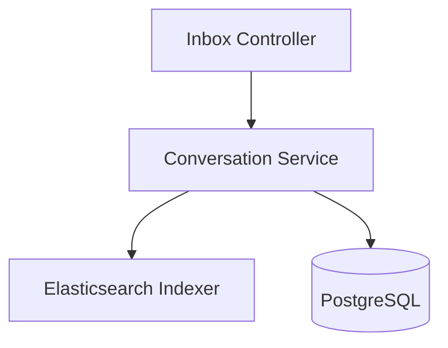
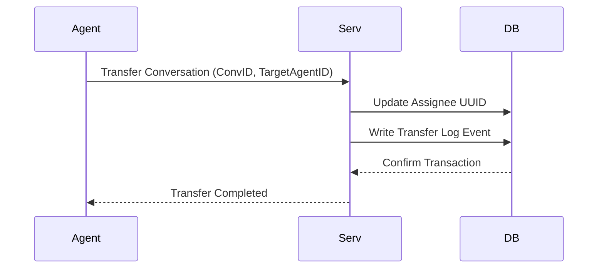
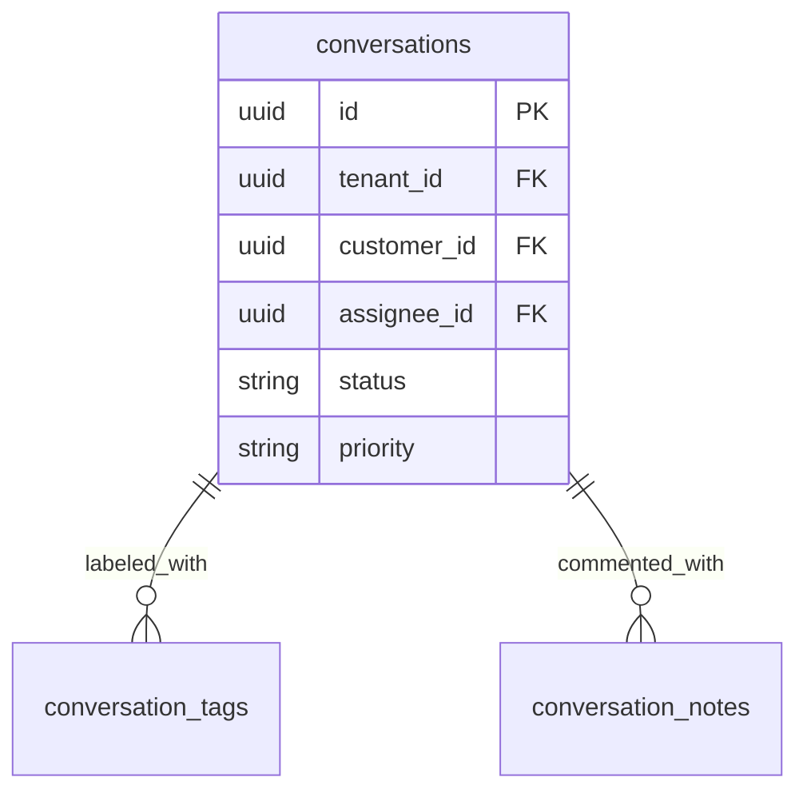
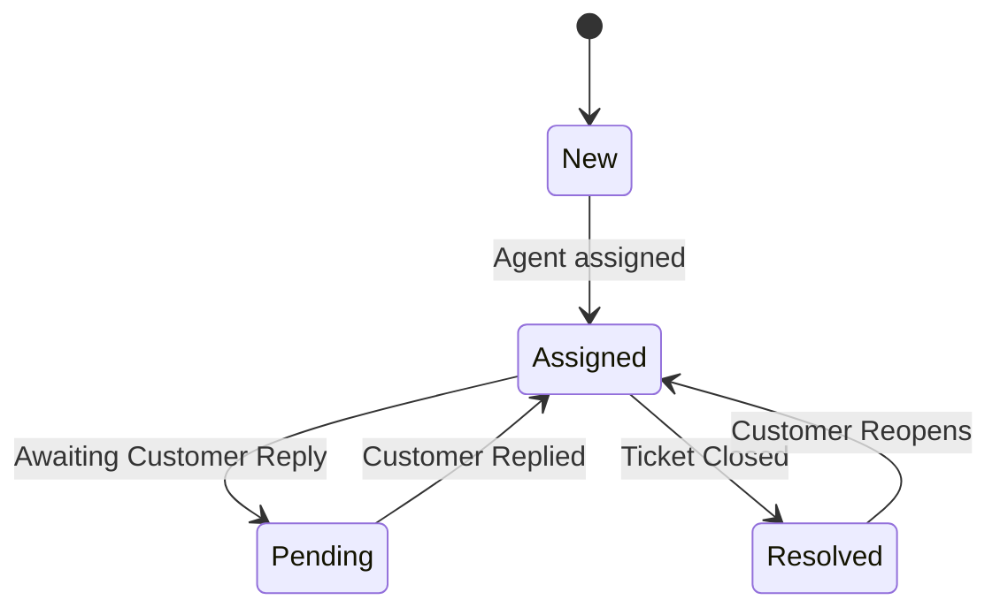
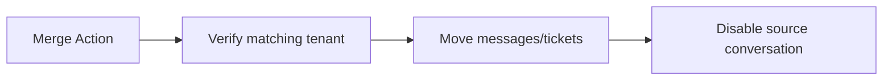

# SYSTEM DOCUMENTATION: CONVERSATION MODULE

---

## 1. MODULE OVERVIEW

### 1.1 Purpose & Responsibilities
Maintains conversation state transitions, priorities, metadata tags, transfers between agents or teams, and project updates onto the Unified Inbox projection store.

### 1.2 Dependencies & Owned Tables
* **Dependencies**: Foundation, Customer, Team, Redis.
* **Owned Tables**: `conversations`, `conversation_tags`, `conversation_notes`, `attachments`.

### 1.3 Diagrams

#### Component Diagram


#### Sequence Diagram


#### ER Diagram


#### State Diagram


#### Request Flow Diagram


---

## 2. BUSINESS FLOWS

### 2.1 Conversation Merge
* **Trigger**: Post command received.
* **Processing**: Verifies that both conversations belong to the same tenant. Re-parents all messages and tickets linked to the secondary conversation to the primary conversation. Sets secondary status to `MERGED` and locks it.
* **Failure Handling**: Aborts execution on FK lock timeouts or tenant ID mismatch.

---

## 3. DATA MODEL
```sql
CREATE TABLE ai_support_agent.conversations (
    id UUID PRIMARY KEY DEFAULT gen_random_uuid(),
    tenant_id UUID NOT NULL,
    customer_id UUID NOT NULL REFERENCES ai_support_agent.customers(id),
    assignee_id UUID,
    status VARCHAR(30) DEFAULT 'NEW', -- 'NEW', 'ASSIGNED', 'PENDING', 'RESOLVED', 'MERGED'
    priority VARCHAR(20) DEFAULT 'MEDIUM',
    created_at TIMESTAMP WITH TIME ZONE DEFAULT CURRENT_TIMESTAMP
);
```

---

## 4. API & EVENT DOCUMENTATION
* `POST /v1/conversations/:id/transfer`:
  - Request: `{"targetAssigneeId": "uuid"}`
  - Response: `{"success": true}`
  - Permissions: `conversation:write`
