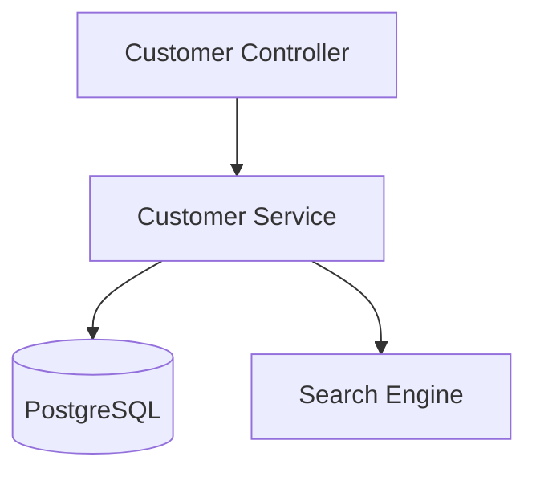
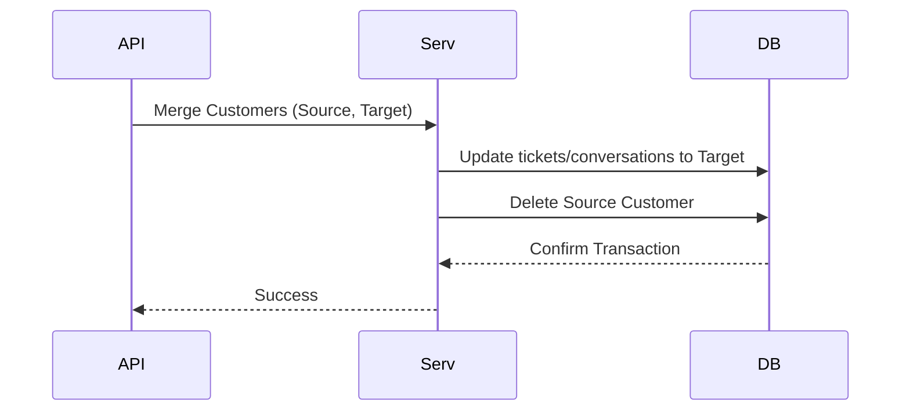
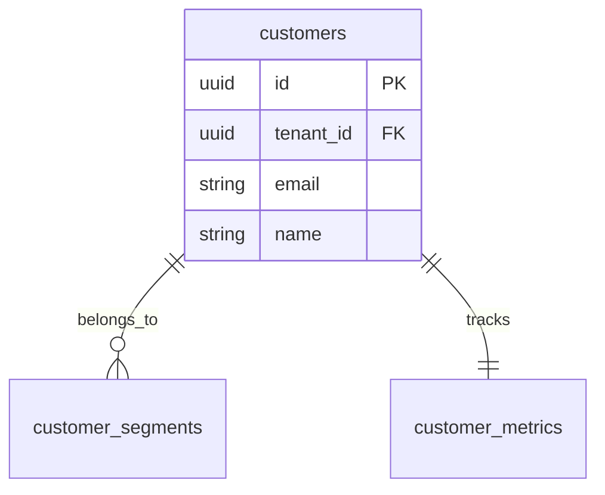
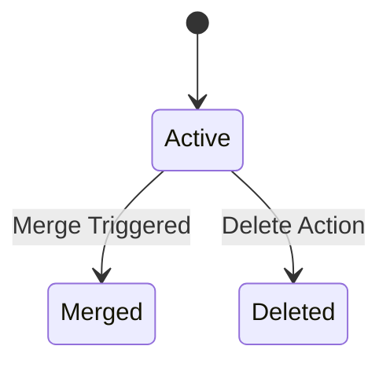

# SYSTEM DOCUMENTATION: CUSTOMER MODULE

---

## 1. MODULE OVERVIEW

### 1.1 Purpose & Responsibilities
Manages the customer lifecycle, Customer 360 aggregation profiles, customer segments, CSV data imports/exports, merge conflict resolution, and indexing for Elasticsearch/search lookups.

### 1.2 Dependencies & Owned Tables
* **Dependencies**: Foundation, Drizzle ORM, Postgres, BullMQ.
* **Owned Tables**: `customers`, `customer_segments`, `customer_metrics`.

### 1.3 Diagrams

#### Component Diagram


#### Sequence Diagram


#### ER Diagram


#### State Diagram


#### Request Flow Diagram


---

## 2. BUSINESS FLOWS

### 2.1 Customer Merge
* **Trigger**: Admin dashboard request.
* **Processing**: Swaps references in `conversations` and `tickets` matching `source_id` to `target_id`. Merges profile attributes. Deletes source.
* **Output**: Combined customer record.
* **Failure Handling**: Rolled back using standard DB transaction.

---

## 3. DATA MODEL
```sql
CREATE TABLE ai_support_agent.customers (
    id UUID PRIMARY KEY DEFAULT gen_random_uuid(),
    tenant_id UUID NOT NULL,
    email VARCHAR(255) NOT NULL,
    name VARCHAR(100),
    created_at TIMESTAMP WITH TIME ZONE DEFAULT CURRENT_TIMESTAMP
);
CREATE UNIQUE INDEX idx_customers_email ON ai_support_agent.customers(tenant_id, email);
```

---

## 4. API DOCUMENTATION
* `POST /v1/customers/merge`:
  - Request: `{"sourceId": "uuid", "targetId": "uuid"}`
  - Response: `{"mergedId": "uuid"}`
  - Permissions: `customer:write`
  - Rate Limit: 10 req/min
