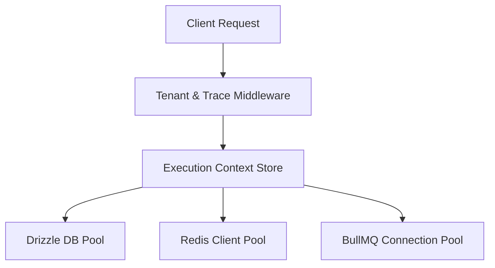
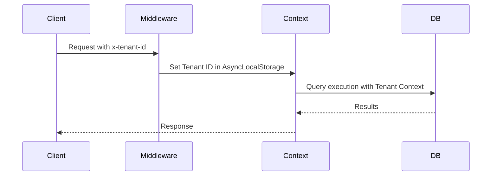
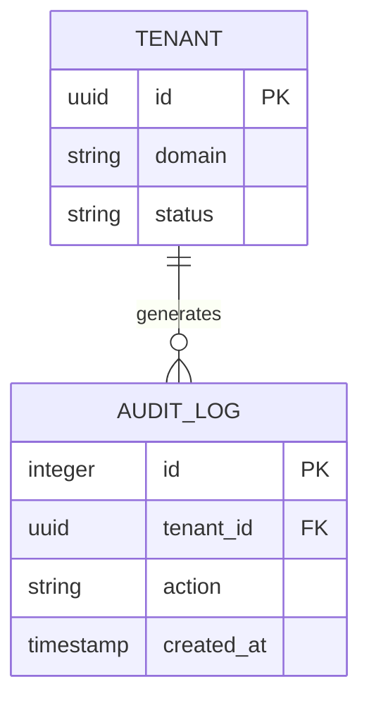
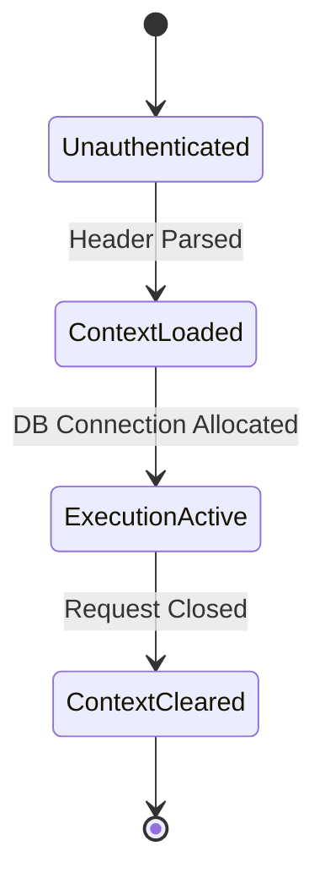
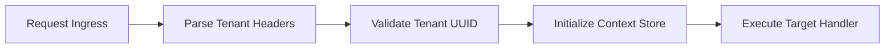

# SYSTEM DOCUMENTATION: FOUNDATION MODULE

---

## 1. MODULE OVERVIEW

### 1.1 Purpose & Responsibilities
The Foundation Module manages the shared infrastructure, tenant context propagation, global database connection pooling, BullMQ client instances, and OpenTelemetry instrumentation hooks.

### 1.2 Dependencies & Owned Tables
* **Dependencies**: NestJS Core, Drizzle ORM, Redis 8, PostgreSQL 17.
* **Owned Tables**: None (allocates global database schema wrapper `ai_support_agent`).

### 1.3 Diagrams

#### Component Diagram


#### Sequence Diagram


#### ER Diagram


#### State Diagram


#### Request Flow Diagram


---

## 2. BUSINESS FLOWS

### 2.1 Tenant Context Ingestion
* **Trigger**: HTTP Request, WebSocket message, or Queue Job.
* **Processing**: Extract `x-tenant-id` header or job payload metadata. Initialize `AsyncLocalStorage` instance containing Tenant and Trace contexts.
* **Failure Handling**: Reject request with HTTP 400 if tenant context is missing and route is tenant-protected.

---

## 3. DATA MODEL
No tables directly owned. Registers schema boundaries for Drizzle:
```typescript
export const pgSchema = pgSchema('ai_support_agent');
```
* **Tenant Isolation Strategy**: Enforces row-level-security (RLS) policies using session parameters (`SET LOCAL app.current_tenant_id = 'tenant_id'`).

---

## 4. API & EVENT DOCUMENTATION
Global middleware registers HTTP filters and intercepts events to inject trace/tenant contexts.
No direct public API endpoints or event production.
