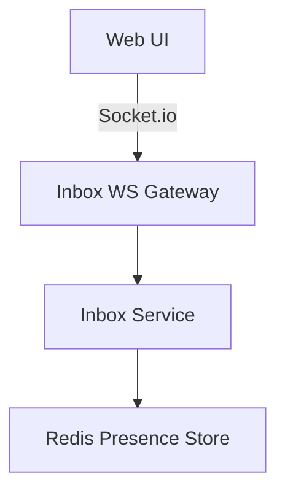
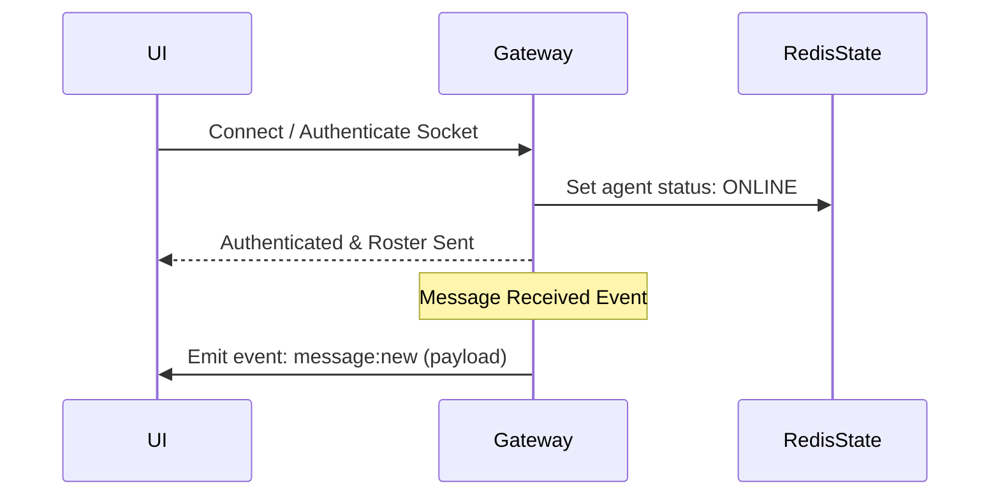
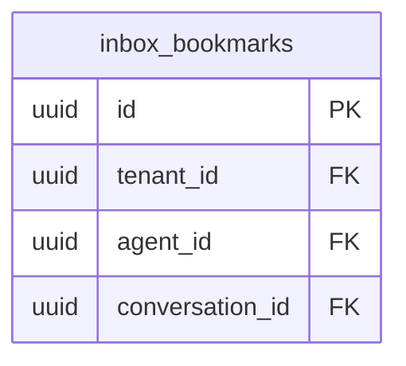
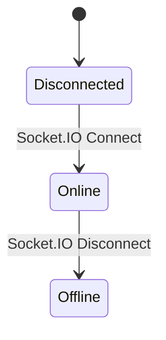

# SYSTEM DOCUMENTATION: UNIFIED INBOX MODULE

---

## 1. MODULE OVERVIEW

### 1.1 Purpose & Responsibilities
Provides real-time dashboards for agent workspaces. It handles WebSocket connections, processes real-time presence indicators, bookmarks conversations, and filters layout lists.

### 1.2 Dependencies & Owned Tables
* **Dependencies**: Foundation, Conversation, Redis (for real-time tracking), Socket.IO.
* **Owned Tables**: `inbox_saved_views`, `inbox_bookmarks`.

### 1.3 Diagrams

#### Component Diagram


#### Sequence Diagram


#### ER Diagram


#### State Diagram


---

## 2. BUSINESS FLOWS

### 2.1 Presence Monitoring
* **Trigger**: Socket connection status change.
* **Processing**: Sets agent's status to `ONLINE` or `OFFLINE` inside Redis hashes (`presence:tenant_id`). Broadcasts status updates to other agents in the same tenant.
* **Output**: Roster presence state update events.

---

## 3. DATA MODEL
```sql
CREATE TABLE ai_support_agent.inbox_bookmarks (
    id UUID PRIMARY KEY DEFAULT gen_random_uuid(),
    tenant_id UUID NOT NULL,
    agent_id UUID NOT NULL,
    conversation_id UUID NOT NULL,
    created_at TIMESTAMP WITH TIME ZONE DEFAULT CURRENT_TIMESTAMP
);
CREATE UNIQUE INDEX idx_inbox_bookmarks_uniq ON ai_support_agent.inbox_bookmarks(tenant_id, agent_id, conversation_id);
```

---

## 4. API & EVENT DOCUMENTATION
* `POST /v1/inbox/bookmarks/add`:
  - Request: `{"conversationId": "uuid"}`
  - Response: `{"bookmarked": true}`
  - Permissions: `conversation:read`
