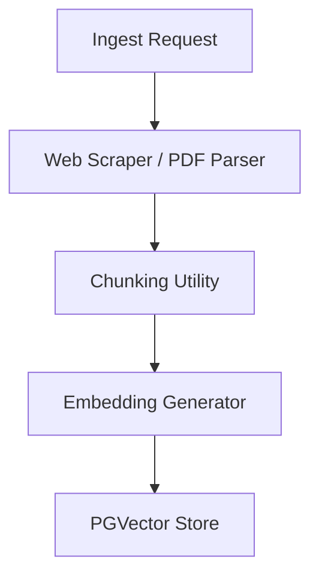
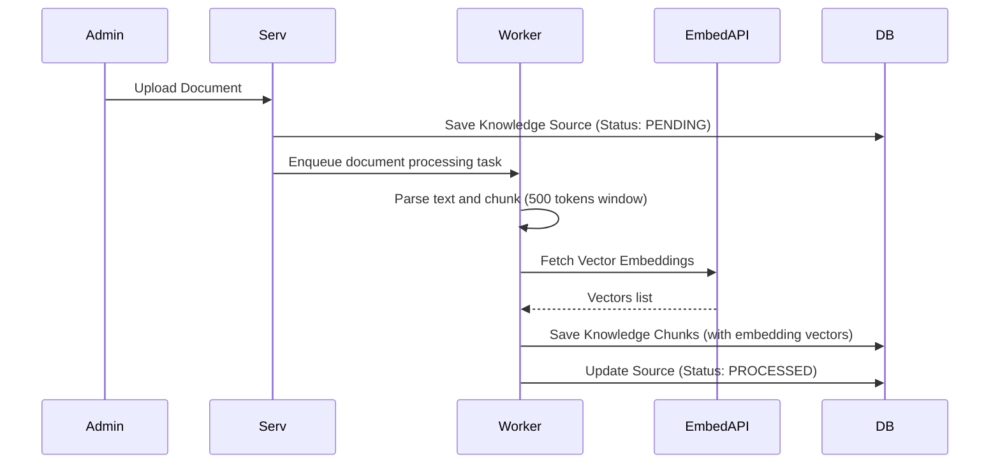
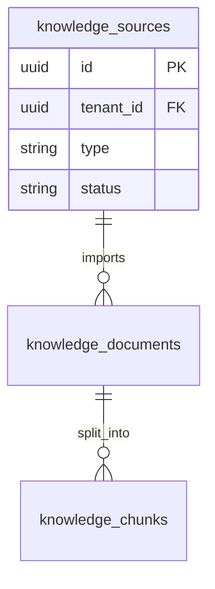
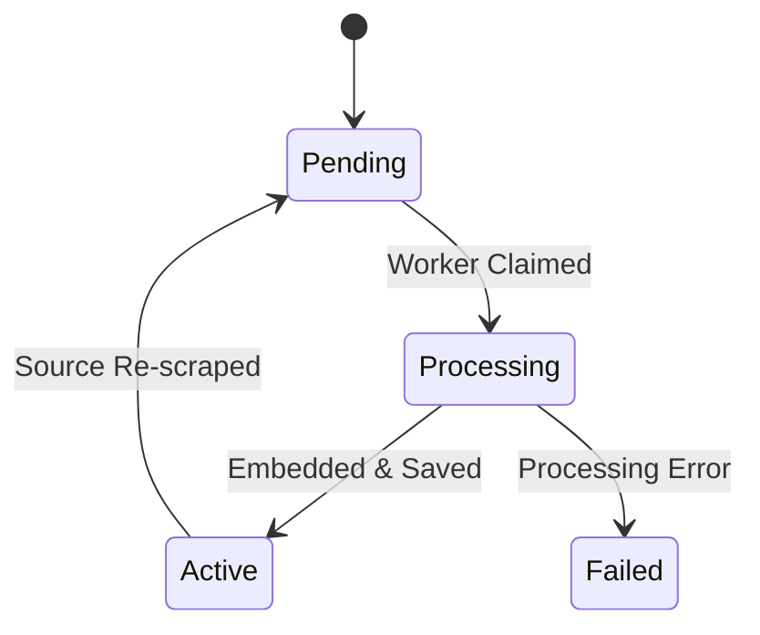
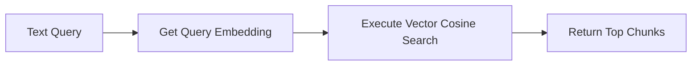

# SYSTEM DOCUMENTATION: KNOWLEDGE BASE MODULE

---

## 1. MODULE OVERVIEW

### 1.1 Purpose & Responsibilities
Ingests and parses document files (PDFs, Web scrapers, FAQs), segments text into chunks, generates vector embeddings, and stores index entries in the vector store for AI search.

### 1.2 Dependencies & Owned Tables
* **Dependencies**: Foundation, BullMQ, AI Platform (Embedding Model API).
* **Owned Tables**: `knowledge_documents`, `knowledge_sources`, `knowledge_chunks`.

### 1.3 Diagrams

#### Component Diagram


#### Sequence Diagram


#### ER Diagram


#### State Diagram


#### Request Flow Diagram


---

## 2. BUSINESS FLOWS

### 2.1 PDF Ingestion Pipeline
* **Trigger**: Post upload action.
* **Processing**: Saves raw PDF into local/S3 store. Enqueues a job inside `knowledge-queue`. The background worker parses the text structure, splits it into overlap chunks of 500 characters, calls AI platform for vector mapping, and saves vectors using PGVector extensions.
* **Failure Handling**: Moves failed chunks to audit logging; sets status to `FAILED`.

---

## 3. DATA MODEL
```sql
CREATE TABLE ai_support_agent.knowledge_sources (
    id UUID PRIMARY KEY DEFAULT gen_random_uuid(),
    tenant_id UUID NOT NULL,
    type VARCHAR(30) NOT NULL, -- 'FILE', 'WEB_SCRAPER', 'FAQ'
    status VARCHAR(20) DEFAULT 'PENDING',
    created_at TIMESTAMP WITH TIME ZONE DEFAULT CURRENT_TIMESTAMP
);

CREATE TABLE ai_support_agent.knowledge_chunks (
    id UUID PRIMARY KEY DEFAULT gen_random_uuid(),
    tenant_id UUID NOT NULL,
    source_id UUID NOT NULL REFERENCES ai_support_agent.knowledge_sources(id),
    content TEXT NOT NULL,
    embedding VECTOR(1536) -- Requires PGVector extension
);
```

---

## 4. API & EVENT DOCUMENTATION
* `POST /v1/knowledge/upload`:
  - Request: Multipart file form data.
  - Response: Source metadata record.
  - Permissions: `knowledge:write`
