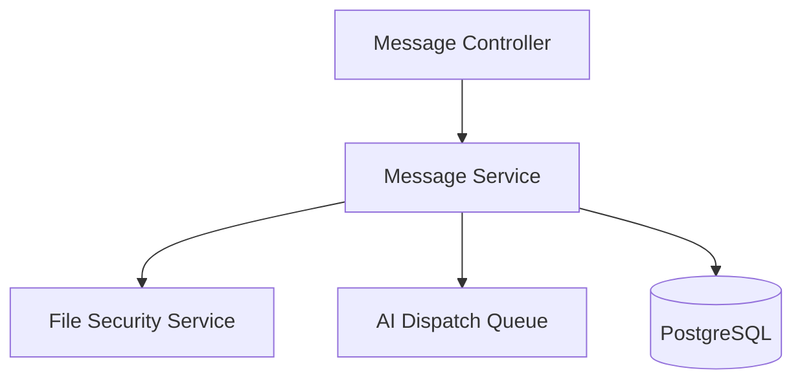
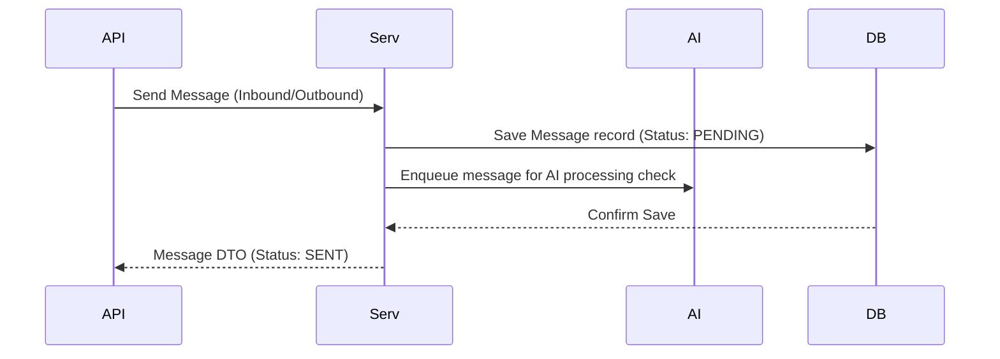
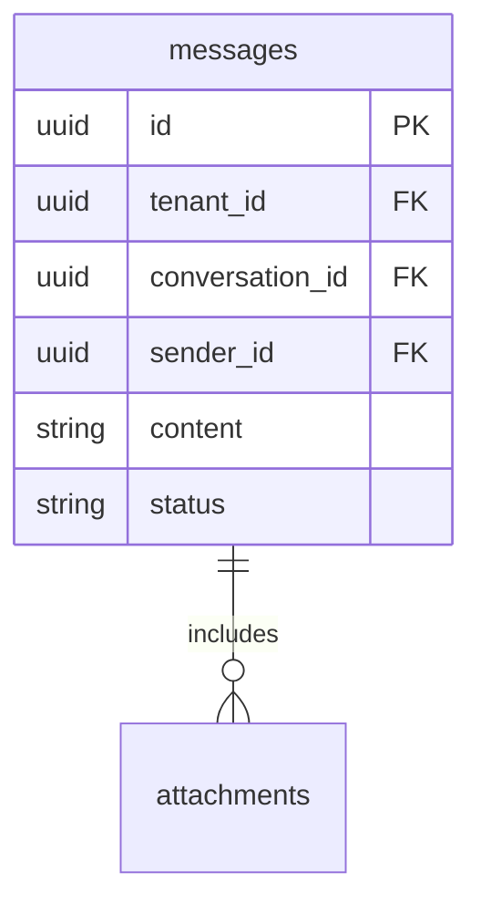
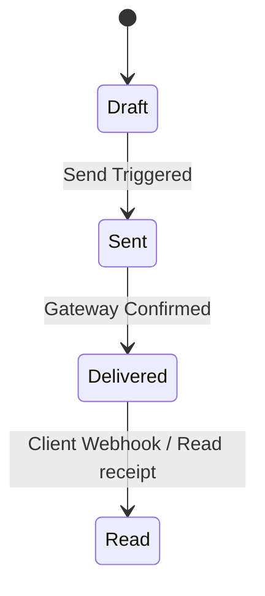

# SYSTEM DOCUMENTATION: MESSAGE MODULE

---

## 1. MODULE OVERVIEW

### 1.1 Purpose & Responsibilities
Governs the creation, storage, rendering, and delivery tracking of messages. Triggers automated AI agents based on conversation message histories, tracks browser read receipts, and validates document attachments.

### 1.2 Dependencies & Owned Tables
* **Dependencies**: Foundation, Conversation, File Security (for parsing attachments).
* **Owned Tables**: `messages`, `attachments`.

### 1.3 Diagrams

#### Component Diagram


#### Sequence Diagram


#### ER Diagram


#### State Diagram


#### Request Flow Diagram


---

## 2. BUSINESS FLOWS

### 2.1 Outbound Message Send
* **Trigger**: Post request on `/v1/messages/send`.
* **Processing**: Performs size checking. Runs attachments through file security scanners (Spoof/double extension detection). Persists row to `messages`. Emits `MESSAGE_SENT` event.
* **Output**: Delivers payloads to external channel integrations (WhatsApp, email, slack).

---

## 3. DATA MODEL
```sql
CREATE TABLE ai_support_agent.messages (
    id UUID PRIMARY KEY DEFAULT gen_random_uuid(),
    tenant_id UUID NOT NULL,
    conversation_id UUID NOT NULL REFERENCES ai_support_agent.conversations(id),
    content TEXT,
    status VARCHAR(20) DEFAULT 'SENT', -- 'DRAFT', 'SENT', 'DELIVERED', 'READ'
    created_at TIMESTAMP WITH TIME ZONE DEFAULT CURRENT_TIMESTAMP
);
```

---

## 4. API & EVENT DOCUMENTATION
* `POST /v1/messages/send`:
  - Request: `{"conversationId": "uuid", "content": "hello"}`
  - Response: Message object.
  - Permissions: `conversation:write`
