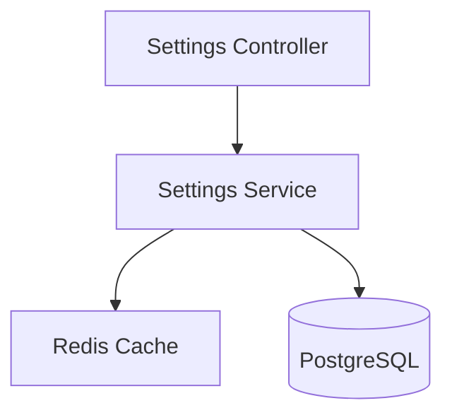
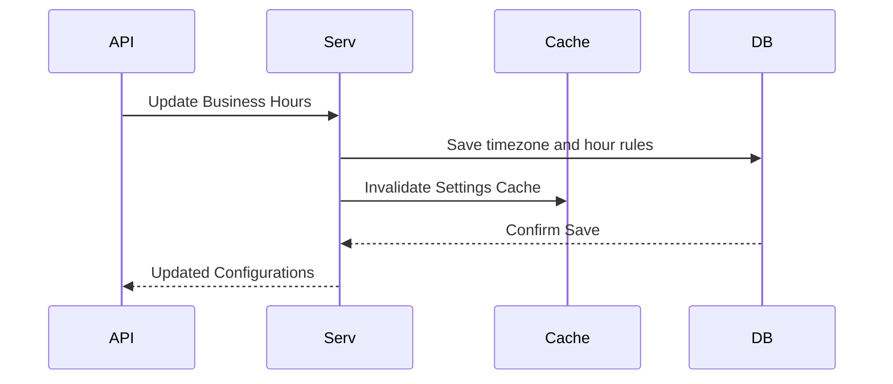
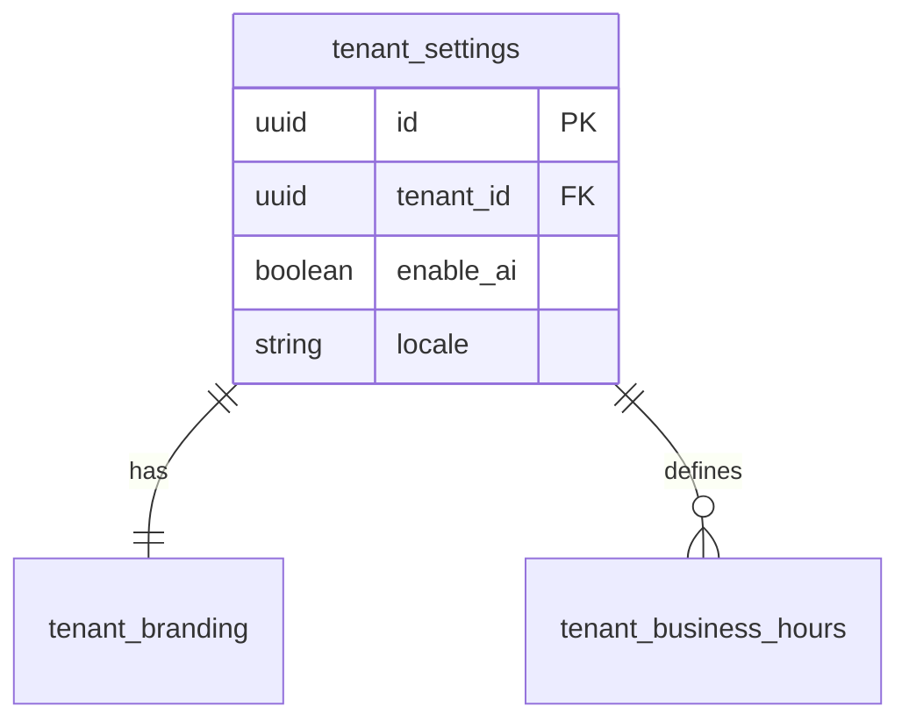
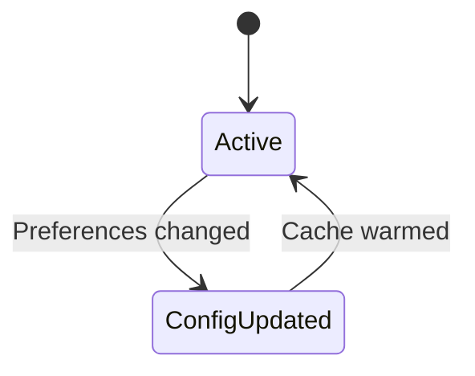

# SYSTEM DOCUMENTATION: SETTINGS MODULE

---

## 1. MODULE OVERVIEW

### 1.1 Purpose & Responsibilities
Maintains configuration variables for all tenants, including active channels, branding parameters, weekly business calendars, AI thresholds, and feature flags.

### 1.2 Dependencies & Owned Tables
* **Dependencies**: Foundation.
* **Owned Tables**: `tenant_settings`, `tenant_preferences`, `tenant_branding`, `tenant_business_hours`.

### 1.3 Diagrams

#### Component Diagram


#### Sequence Diagram


#### ER Diagram


#### State Diagram


---

## 2. BUSINESS FLOWS

### 2.1 Settings Update propagation
* **Trigger**: PATCH call to settings endpoints.
* **Processing**: Persists values to Postgres settings tables. Dispatches a cache invalidation signal over Redis Pub/Sub to reload system behaviors.
* **Output**: Flushed settings caches on active nodes.

---

## 3. DATA MODEL
```sql
CREATE TABLE ai_support_agent.tenant_settings (
    id UUID PRIMARY KEY DEFAULT gen_random_uuid(),
    tenant_id UUID UNIQUE NOT NULL,
    enable_ai BOOLEAN DEFAULT FALSE,
    locale VARCHAR(10) DEFAULT 'en',
    created_at TIMESTAMP WITH TIME ZONE DEFAULT CURRENT_TIMESTAMP
);

CREATE TABLE ai_support_agent.tenant_business_hours (
    id UUID PRIMARY KEY DEFAULT gen_random_uuid(),
    tenant_id UUID NOT NULL REFERENCES ai_support_agent.tenant_settings(tenant_id),
    day_of_week INT NOT NULL, -- 0 (Sunday) to 6 (Saturday)
    start_time TIME NOT NULL,
    end_time TIME NOT NULL
);
```

---

## 4. API & EVENT DOCUMENTATION
* `PATCH /v1/settings/preferences`:
  - Request: `{"enableAi": true}`
  - Response: Updated preferences payload.
  - Permissions: `settings:write`
