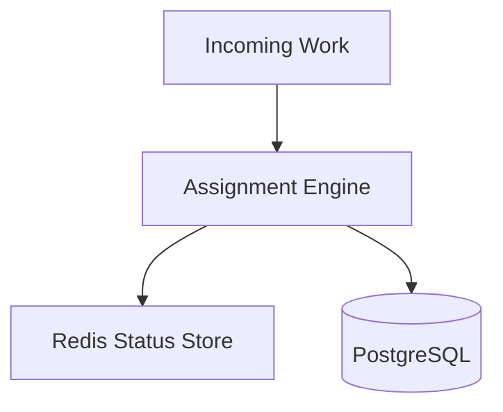
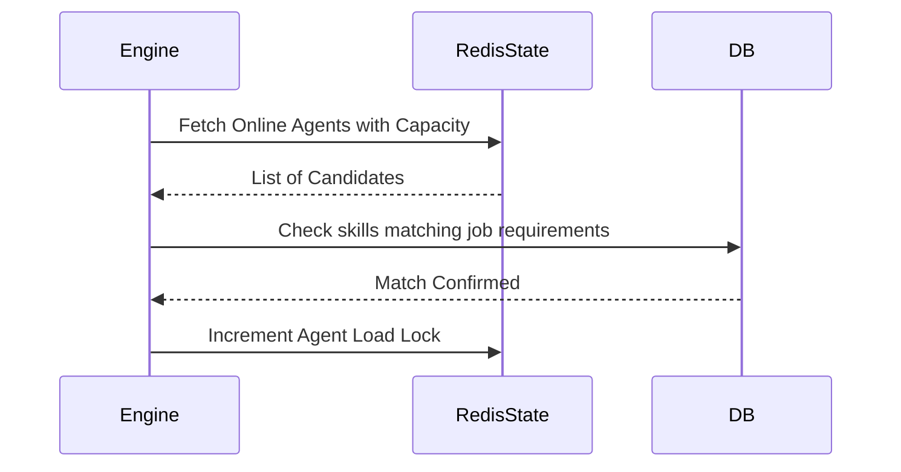
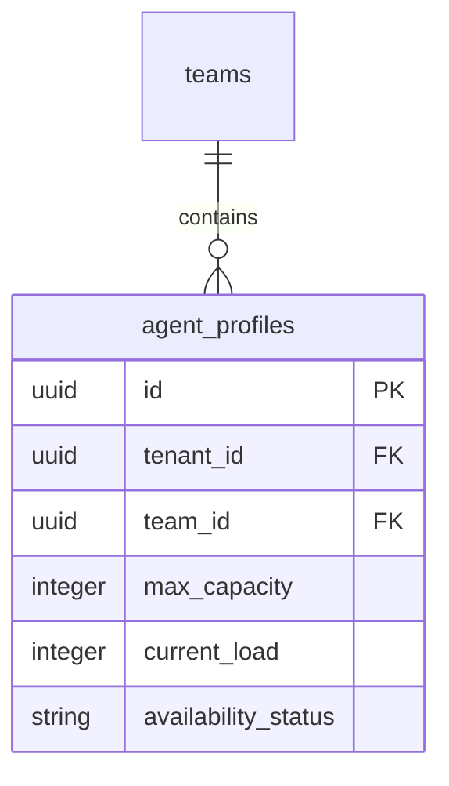
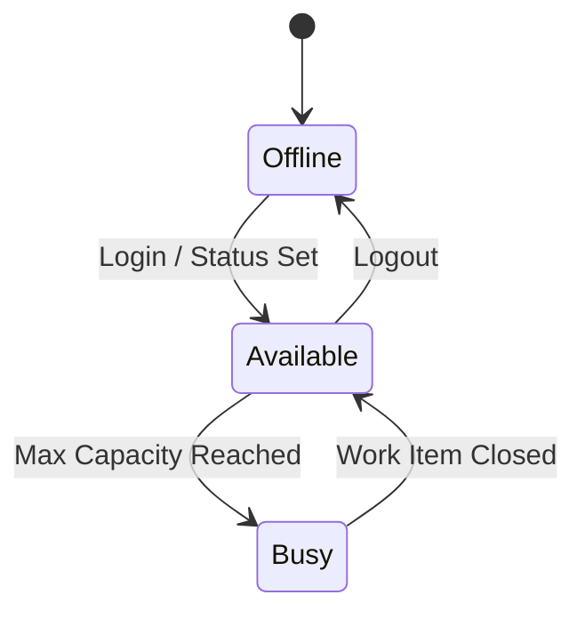
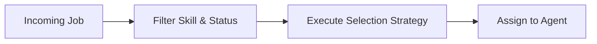

# SYSTEM DOCUMENTATION: TEAM MODULE

---

## 1. MODULE OVERVIEW

### 1.1 Purpose & Responsibilities
Administrates human resources routing. It maps agents to specific teams, manages their active status/availability, tracking capacity limitations, and executing routing selections (Round-robin, least-loaded, skill-based).

### 1.2 Dependencies & Owned Tables
* **Dependencies**: Foundation, Redis (for tracking real-time status/locks).
* **Owned Tables**: `teams`, `agent_profiles`.

### 1.3 Diagrams

#### Component Diagram


#### Sequence Diagram


#### ER Diagram


#### State Diagram


#### Request Flow Diagram


---

## 2. BUSINESS FLOWS

### 2.1 Least Loaded Assignment
* **Trigger**: A new conversation needs human allocation.
* **Processing**: Queries Redis caches/Postgres for agents in matching team whose `current_load < max_capacity` and status is `Available`. Selects the one with the lowest load. Increments current load counter.
* **Failure Handling**: If no agents are available, queue the job and notify supervisors.

---

## 3. DATA MODEL
```sql
CREATE TABLE ai_support_agent.teams (
    id UUID PRIMARY KEY DEFAULT gen_random_uuid(),
    tenant_id UUID NOT NULL,
    name VARCHAR(100) NOT NULL
);

CREATE TABLE ai_support_agent.agent_profiles (
    id UUID PRIMARY KEY DEFAULT gen_random_uuid(),
    tenant_id UUID NOT NULL,
    team_id UUID REFERENCES ai_support_agent.teams(id),
    max_capacity INT DEFAULT 5,
    current_load INT DEFAULT 0,
    availability_status VARCHAR(20) DEFAULT 'OFFLINE'
);
```

---

## 4. API & EVENT DOCUMENTATION
* `PUT /v1/teams/agents/:id/status`:
  - Request: `{"status": "AVAILABLE"}`
  - Response: `{"success": true}`
  - Permissions: `team:write`
