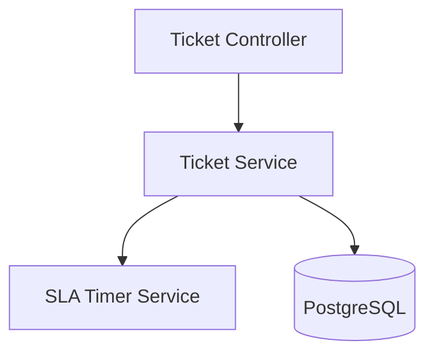
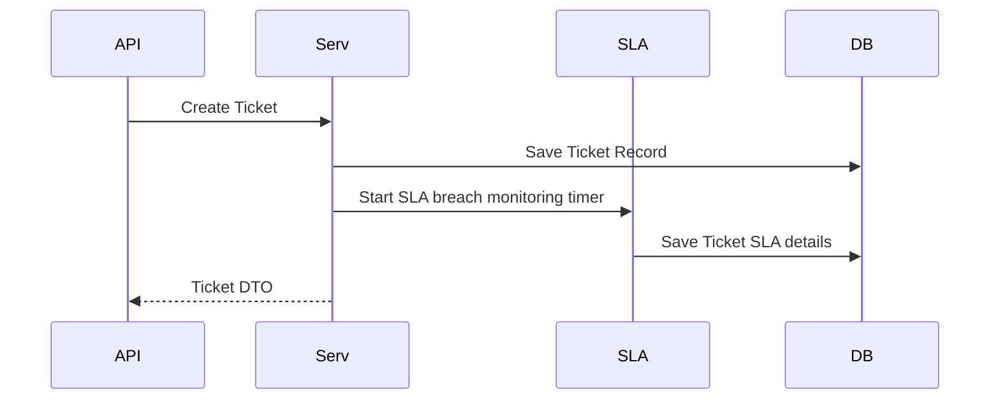
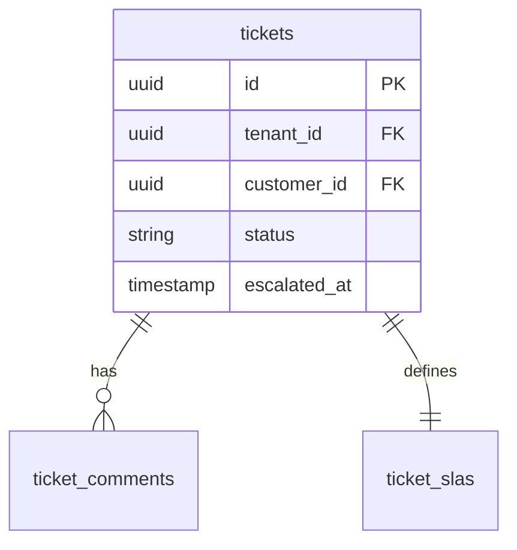
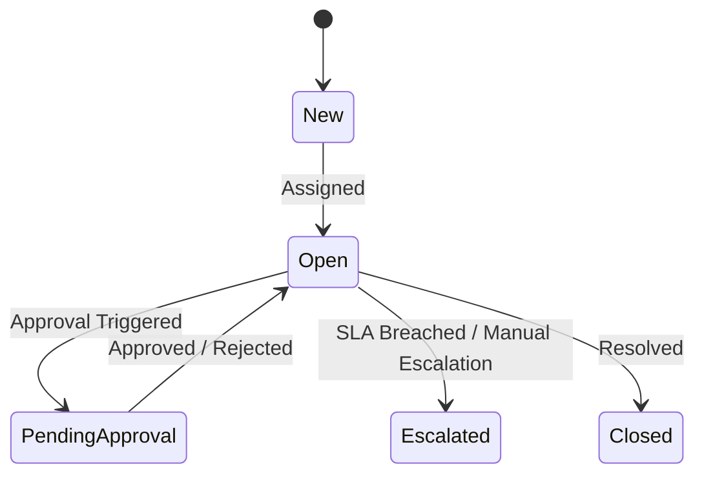
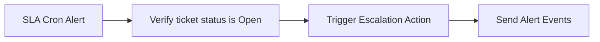

# SYSTEM DOCUMENTATION: TICKET MODULE

---

## 1. MODULE OVERVIEW

### 1.1 Purpose & Responsibilities
Governs operational support tickets. It tracks SLA deadlines, manages approval workflows, triggers escalations, and aggregates analytical metrics.

### 1.2 Dependencies & Owned Tables
* **Dependencies**: Foundation, Conversation, Workflow, Scheduler (for SLA timers).
* **Owned Tables**: `tickets`, `ticket_comments`, `ticket_slas`.

### 1.3 Diagrams

#### Component Diagram


#### Sequence Diagram


#### ER Diagram


#### State Diagram


#### Request Flow Diagram


---

## 2. BUSINESS FLOWS

### 2.1 SLA Breach Escalation
* **Trigger**: Scheduling cron job or Redis timer expires.
* **Processing**: Queries table `ticket_slas` to check for open tickets exceeding breach deadlines. Sets status to `ESCALATED`. Re-assigns ticket to target tier-2 support team.
* **Output**: Publishes `TICKET_ESCALATED` event.

---

## 3. DATA MODEL
```sql
CREATE TABLE ai_support_agent.tickets (
    id UUID PRIMARY KEY DEFAULT gen_random_uuid(),
    tenant_id UUID NOT NULL,
    customer_id UUID NOT NULL REFERENCES ai_support_agent.customers(id),
    status VARCHAR(30) DEFAULT 'NEW', -- 'NEW', 'OPEN', 'PENDING_APPROVAL', 'ESCALATED', 'CLOSED'
    escalated_at TIMESTAMP WITH TIME ZONE,
    created_at TIMESTAMP WITH TIME ZONE DEFAULT CURRENT_TIMESTAMP
);

CREATE TABLE ai_support_agent.ticket_slas (
    id UUID PRIMARY KEY DEFAULT gen_random_uuid(),
    tenant_id UUID NOT NULL,
    ticket_id UUID NOT NULL REFERENCES ai_support_agent.tickets(id),
    breach_deadline TIMESTAMP WITH TIME ZONE NOT NULL,
    is_breached BOOLEAN DEFAULT FALSE
);
```

---

## 4. API & EVENT DOCUMENTATION
* `POST /v1/tickets/:id/escalate`:
  - Request: `{"escalationReason": "string"}`
  - Response: Ticket object.
  - Permissions: `ticket:write`
