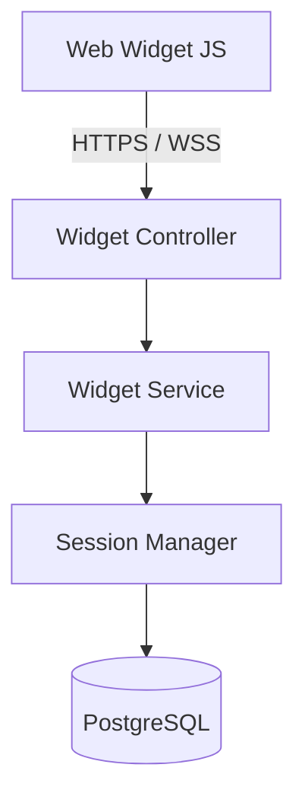
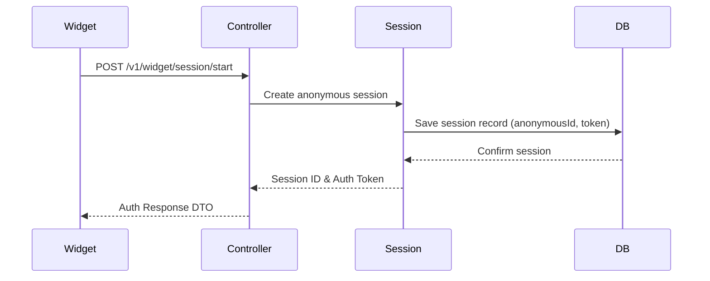
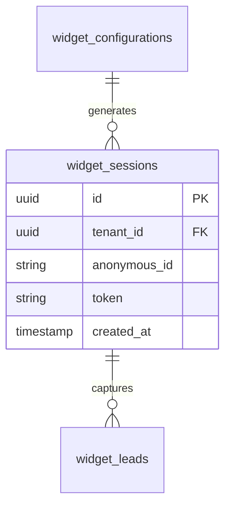
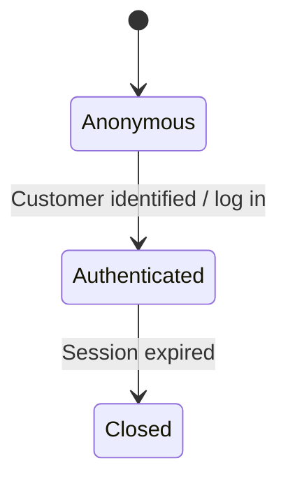

# SYSTEM DOCUMENTATION: WIDGET BACKEND MODULE

---

## 1. MODULE OVERVIEW

### 1.1 Purpose & Responsibilities
Serves visitor lifecycle endpoints. It initializes public sessions, captures lead data, authenticates visitors, structures the WebSocket communication flow, and configures widget branding styles.

### 1.2 Dependencies & Owned Tables
* **Dependencies**: Foundation, Conversation, Customer, Socket.IO.
* **Owned Tables**: `widget_configurations`, `widget_sessions`, `widget_leads`.

### 1.3 Diagrams

#### Component Diagram


#### Sequence Diagram


#### ER Diagram


#### State Diagram


---

## 2. BUSINESS FLOWS

### 2.1 Lead Capture
* **Trigger**: Post command to widget api payload endpoint.
* **Processing**: Receives visitor details. Resolves Customer profiles matching email. Links customer record to the active widget session. Promotes guest to standard customer record.
* **Output**: Updated customer data and qualified lead state.

---

## 3. DATA MODEL
```sql
CREATE TABLE ai_support_agent.widget_sessions (
    id UUID PRIMARY KEY DEFAULT gen_random_uuid(),
    tenant_id UUID NOT NULL,
    anonymous_id VARCHAR(100) NOT NULL,
    token TEXT NOT NULL,
    created_at TIMESTAMP WITH TIME ZONE DEFAULT CURRENT_TIMESTAMP
);
```

---

## 4. API & EVENT DOCUMENTATION
* `POST /v1/widget/session/start`:
  - Request: `{"anonymousId": "string", "deviceType": "desktop"}`
  - Response: Session ID and auth token payload.
  - Permissions: Public.
