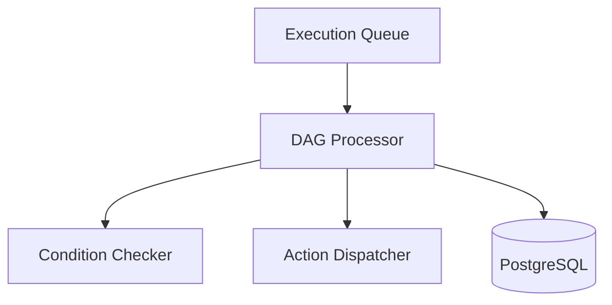
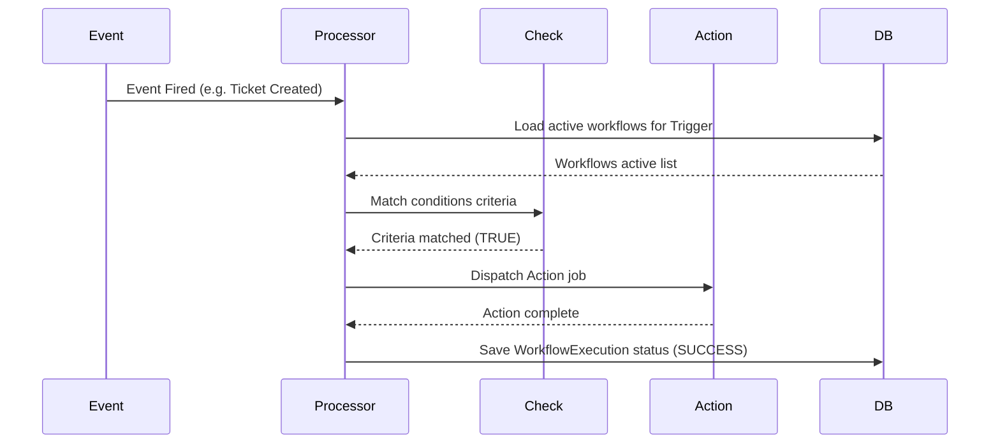
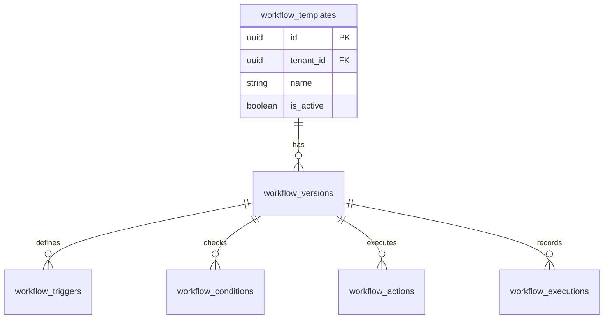
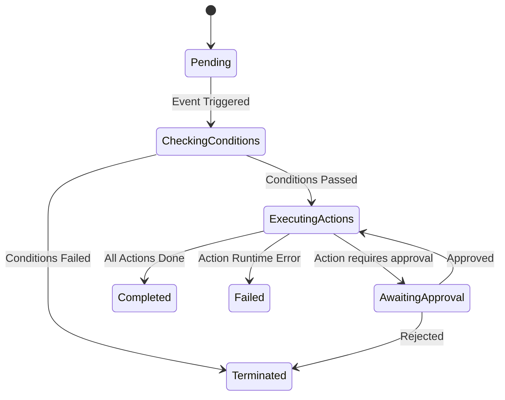
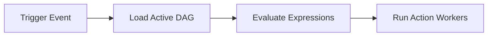

# SYSTEM DOCUMENTATION: WORKFLOW MODULE

---

## 1. MODULE OVERVIEW

### 1.1 Purpose & Responsibilities
Executes rule-based automated event pipelines. It interprets conditional logic rules, triggers actions (such as sending emails, routing tickets, or calling connectors), manages approval flows, and handles execution schedules.

### 1.2 Dependencies & Owned Tables
* **Dependencies**: Foundation, Connector, Ticket, Conversation.
* **Owned Tables**: `workflow_templates`, `workflow_versions`, `workflow_executions`, `workflow_triggers`, `workflow_conditions`, `workflow_actions`, `workflow_approvals`, `workflow_schedules`, `workflow_audit_logs`, `workflow_variables`.

### 1.3 Diagrams

#### Component Diagram


#### Sequence Diagram


#### ER Diagram


#### State Diagram


#### Request Flow Diagram


---

## 2. BUSINESS FLOWS

### 2.1 Workflow Pipeline Execution
* **Trigger**: Workspace domain events (e.g. `TICKET_CREATED`, `CONVERSATION_ASSIGNED`).
* **Processing**: Fetches the workflow DAG mapping to the trigger. Evaluates variables against condition expressions (e.g. `ticket.priority == 'HIGH'`). Runs matched execution actions sequentially.
* **Output**: Writes audit trails, performs connector integrations or notifications.

---

## 3. DATA MODEL
```sql
CREATE TABLE ai_support_agent.workflow_templates (
    id UUID PRIMARY KEY DEFAULT gen_random_uuid(),
    tenant_id UUID NOT NULL,
    name VARCHAR(100) NOT NULL,
    is_active BOOLEAN DEFAULT TRUE,
    created_at TIMESTAMP WITH TIME ZONE DEFAULT CURRENT_TIMESTAMP
);

CREATE TABLE ai_support_agent.workflow_executions (
    id UUID PRIMARY KEY DEFAULT gen_random_uuid(),
    tenant_id UUID NOT NULL,
    template_id UUID NOT NULL REFERENCES ai_support_agent.workflow_templates(id),
    status VARCHAR(20) DEFAULT 'PENDING', -- 'PENDING', 'RUNNING', 'COMPLETED', 'FAILED'
    execution_log JSONB,
    created_at TIMESTAMP WITH TIME ZONE DEFAULT CURRENT_TIMESTAMP
);
```

---

## 4. API & EVENT DOCUMENTATION
* `POST /v1/workflows/trigger`:
  - Request: `{"eventId": "uuid", "eventType": "TICKET_CREATED"}`
  - Response: `{"executionId": "uuid"}`
  - Permissions: Internal / Service
